# Agent Framework Documentation

This document provides detailed information about the OpenManus agent framework, including agent types, lifecycle management, and extensibility patterns.

## Agent Hierarchy

### Base Agent Class

The `BaseAgent` class provides the foundation for all agents in OpenManus:

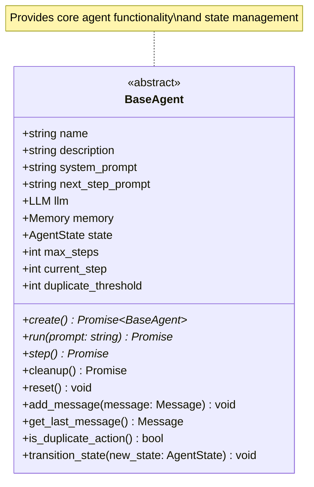

### ToolCall Agent

The `ToolCallAgent` extends `BaseAgent` with tool execution capabilities:

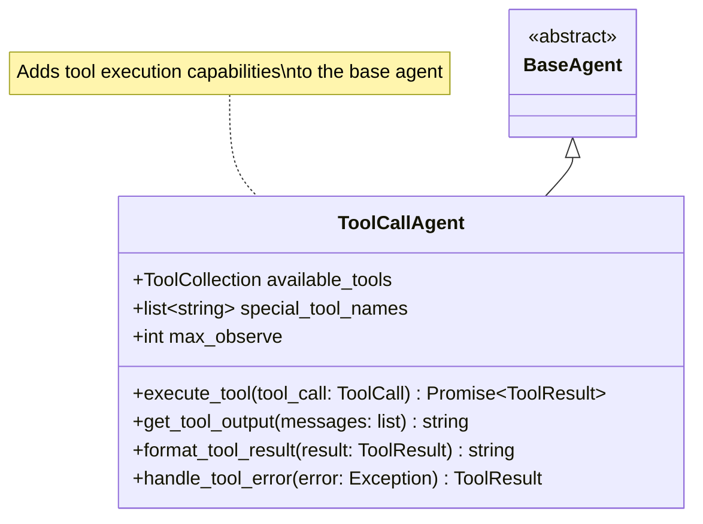

### Specialized Agents

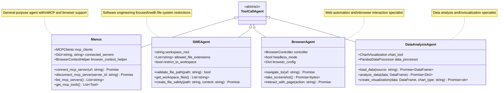

## Agent Lifecycle

### State Management

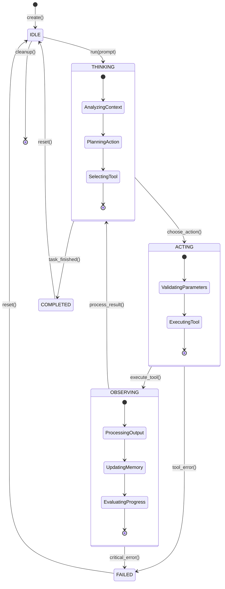

### Step Execution Flow

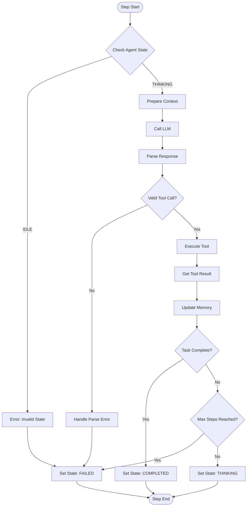

## Memory Management

### Memory Structure

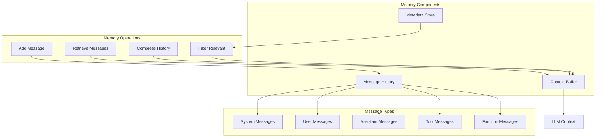

### Context Management

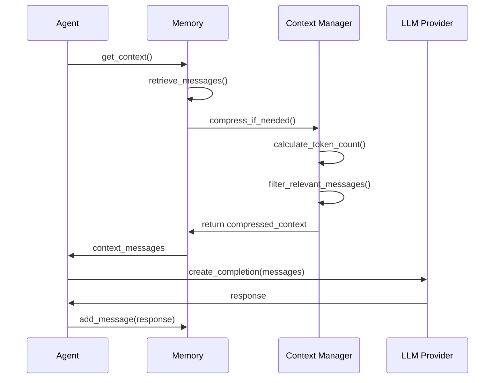

## Tool Integration

### Tool Registration

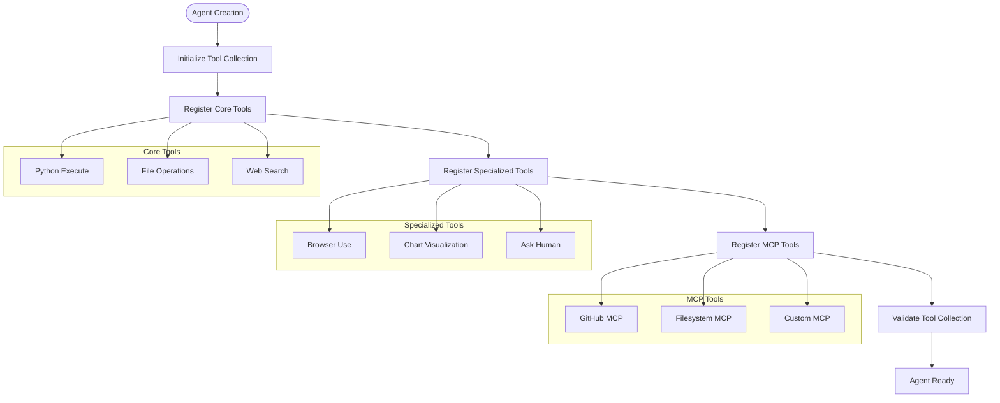

### Tool Execution Pattern

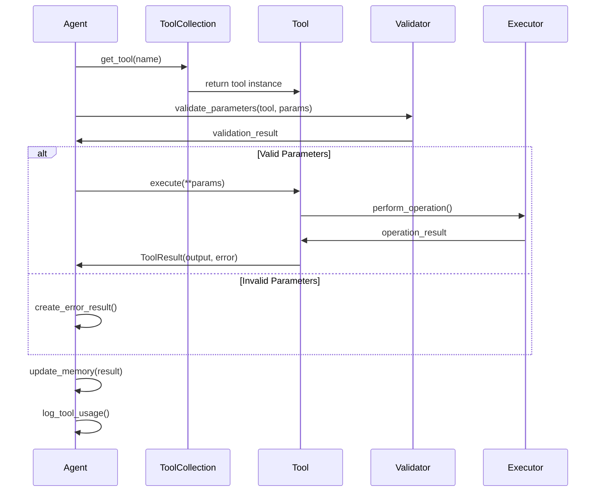

## Agent Configuration

### Configuration Schema

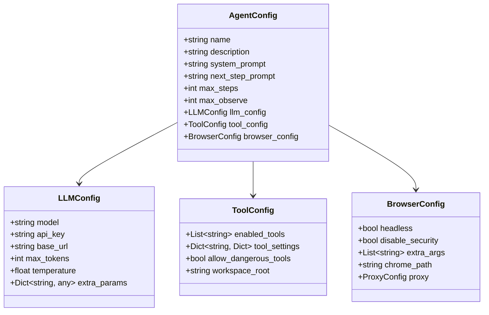

## Extensibility Patterns

### Creating Custom Agents

```python
from app.agent.toolcall import ToolCallAgent
from app.tool import ToolCollection, PythonExecute

class CustomAgent(ToolCallAgent):
    """Custom agent for specific domain tasks."""
    
    name: str = "CustomAgent"
    description: str = "Specialized agent for domain-specific tasks"
    
    # Define custom tools
    available_tools: ToolCollection = Field(
        default_factory=lambda: ToolCollection(
            PythonExecute(),
            # Add custom tools here
        )
    )
    
    async def custom_method(self):
        """Custom agent-specific functionality."""
        pass
    
    async def step(self):
        """Override step method for custom behavior."""
        # Custom step logic
        result = await super().step()
        # Post-processing
        return result
```

### Adding Custom Tools

```python
from app.tool.base import BaseTool, ToolResult

class CustomTool(BaseTool):
    name = "custom_tool"
    description = "Description of what this tool does"
    parameters = {
        "type": "object",
        "properties": {
            "param1": {"type": "string", "description": "Parameter description"},
            "param2": {"type": "integer", "description": "Another parameter"}
        },
        "required": ["param1"]
    }
    
    async def execute(self, param1: str, param2: int = 0) -> ToolResult:
        try:
            # Tool implementation
            result = self.perform_operation(param1, param2)
            return ToolResult(output=result)
        except Exception as e:
            return ToolResult(error=str(e))
    
    def perform_operation(self, param1: str, param2: int) -> str:
        """Implement tool-specific logic."""
        return f"Operation result for {param1} with {param2}"
```

## Error Handling

### Error Recovery Patterns

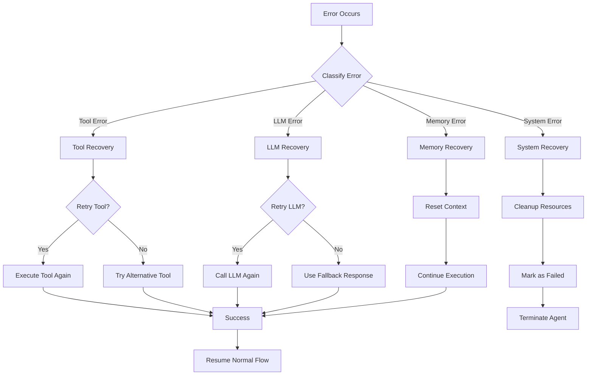

## Performance Optimization

### Memory Optimization

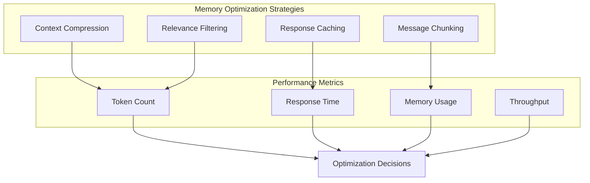

### Execution Optimization

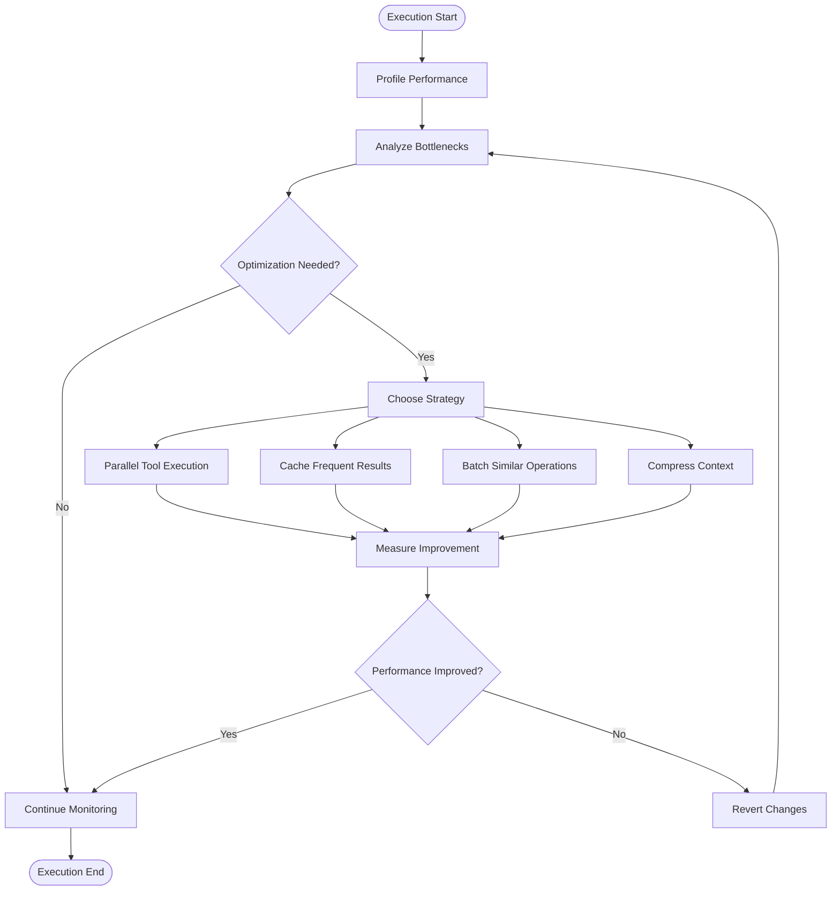

This agent framework documentation provides the foundation for understanding how to work with and extend the OpenManus agent system. Each agent type is designed for specific use cases while maintaining consistency through the common base classes and interfaces.