# OpenManus Technical Architecture

OpenManus is a comprehensive, open-source framework for building general-purpose AI agents. This document provides a detailed technical overview of the system architecture, components, and their interactions.

## Table of Contents

1. [System Overview](#system-overview)
2. [Core Components](#core-components)
3. [Agent Architecture](#agent-architecture)
4. [Tool Framework](#tool-framework)
5. [Flow Management](#flow-management)
6. [LLM Integration](#llm-integration)
7. [MCP Protocol Support](#mcp-protocol-support)
8. [Configuration System](#configuration-system)
9. [Execution Patterns](#execution-patterns)
10. [Data Flow](#data-flow)

## System Overview

OpenManus is built on a modular architecture that separates concerns into distinct layers:

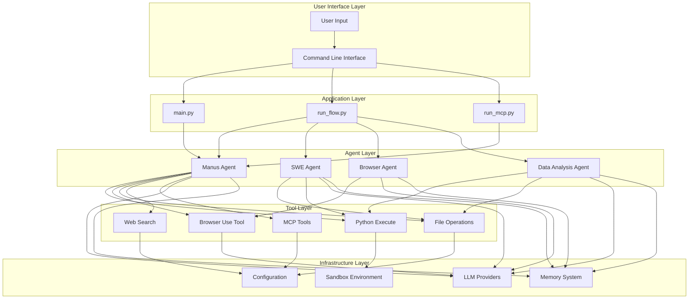

## Core Components

### 1. Agent System

The agent system is the central orchestrator of OpenManus, built on a hierarchical class structure:

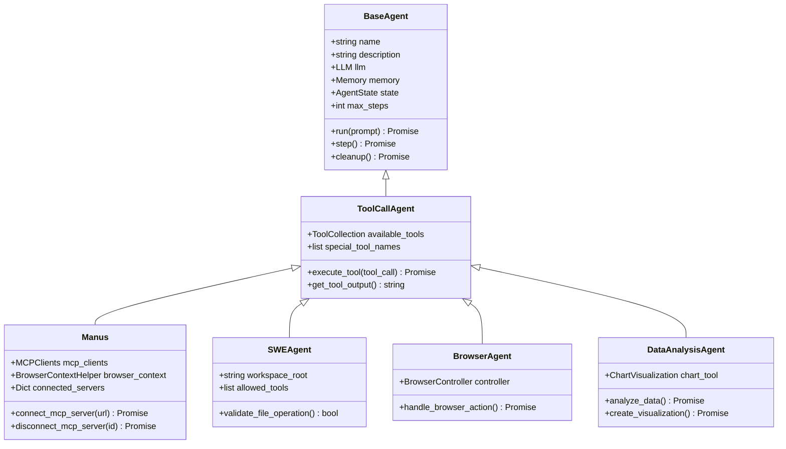

### 2. Tool Framework

Tools provide specific capabilities to agents through a standardized interface:

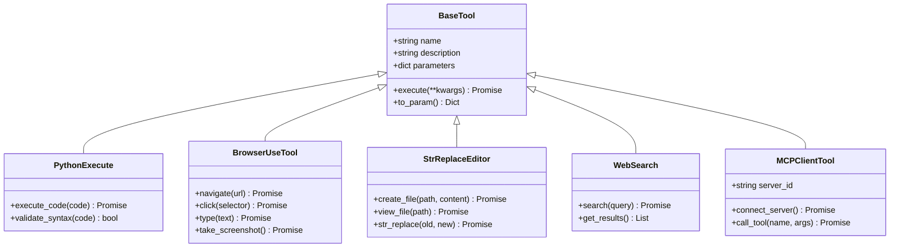

## Agent Architecture

### Agent Lifecycle and State Management

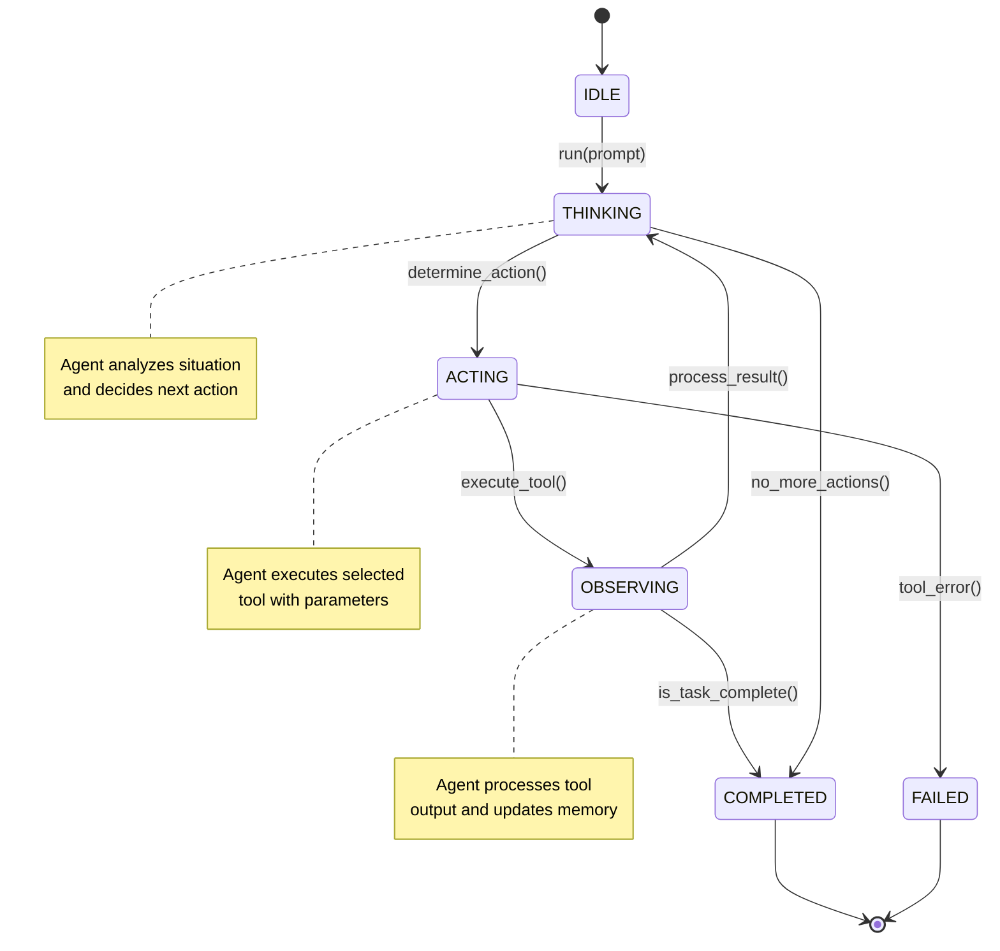

### Memory System

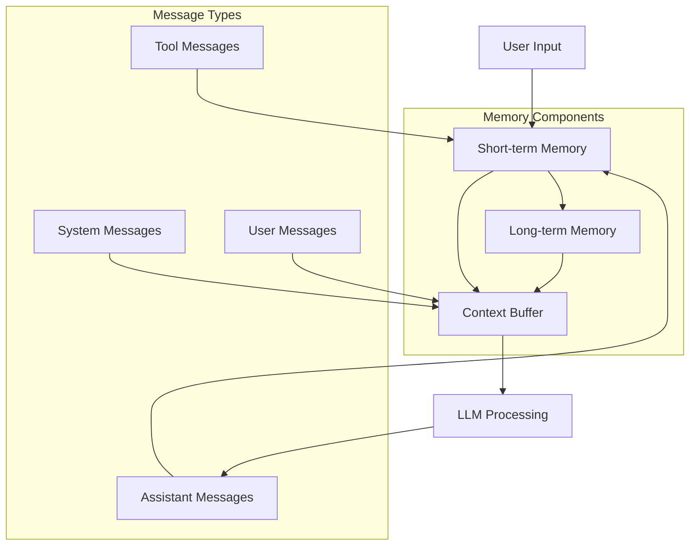

## Tool Framework

### Tool Categories and Relationships

```mermaid
graph TB
    subgraph "Execution Tools"
        PYTHON[Python Execute]
        BASH[Bash Commands]
        DOCKER[Docker Container]
    end
    
    subgraph "File Operations"
        FILE_READ[File Reader]
        FILE_WRITE[File Writer]
        STR_REPLACE[String Replace Editor]
    end
    
    subgraph "Web & Browser"
        BROWSER[Browser Use Tool]
        WEB_SEARCH[Web Search]
        CRAWL[Web Crawler]
    end
    
    subgraph "Data & Analysis"
        CHART[Chart Visualization]
        DATA_PROC[Data Processing]
    end
    
    subgraph "Communication"
        ASK_HUMAN[Ask Human]
        TERMINATE[Terminate]
    end
    
    subgraph "External Integration"
        MCP_CLIENT[MCP Client Tool]
        API_TOOLS[API Tools]
    end
    
    subgraph "Planning & Coordination"
        PLANNING[Planning Tool]
    end
    
    AGENT[Agent] --> PYTHON
    AGENT --> FILE_READ
    AGENT --> BROWSER
    AGENT --> CHART
    AGENT --> ASK_HUMAN
    AGENT --> MCP_CLIENT
    AGENT --> PLANNING
```

### Tool Execution Pattern

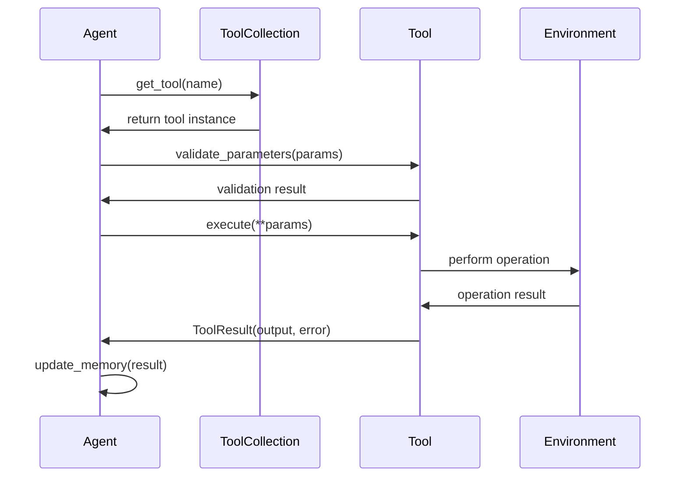

## Flow Management

### Planning Flow Architecture

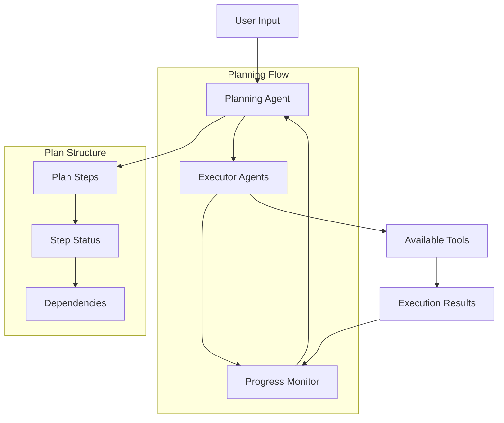

### Multi-Agent Coordination

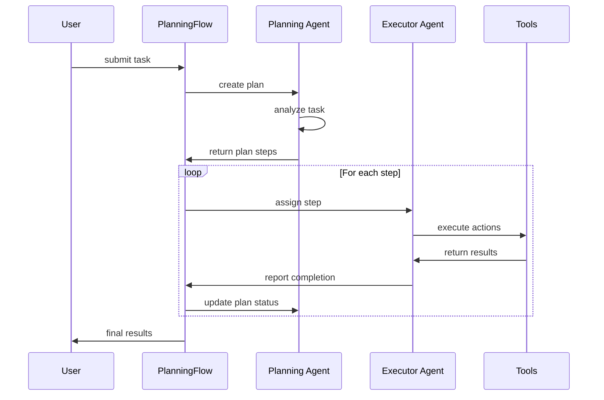

## LLM Integration

### LLM Provider Architecture

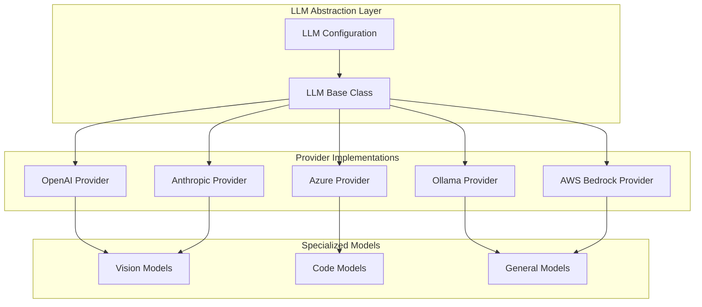

### Message Processing Flow

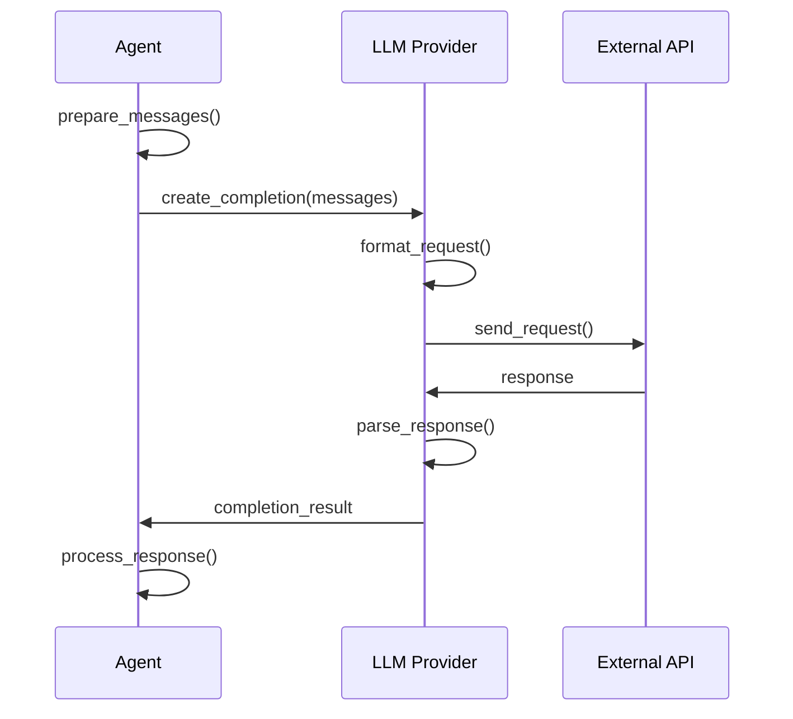

## MCP Protocol Support

### MCP Integration Architecture

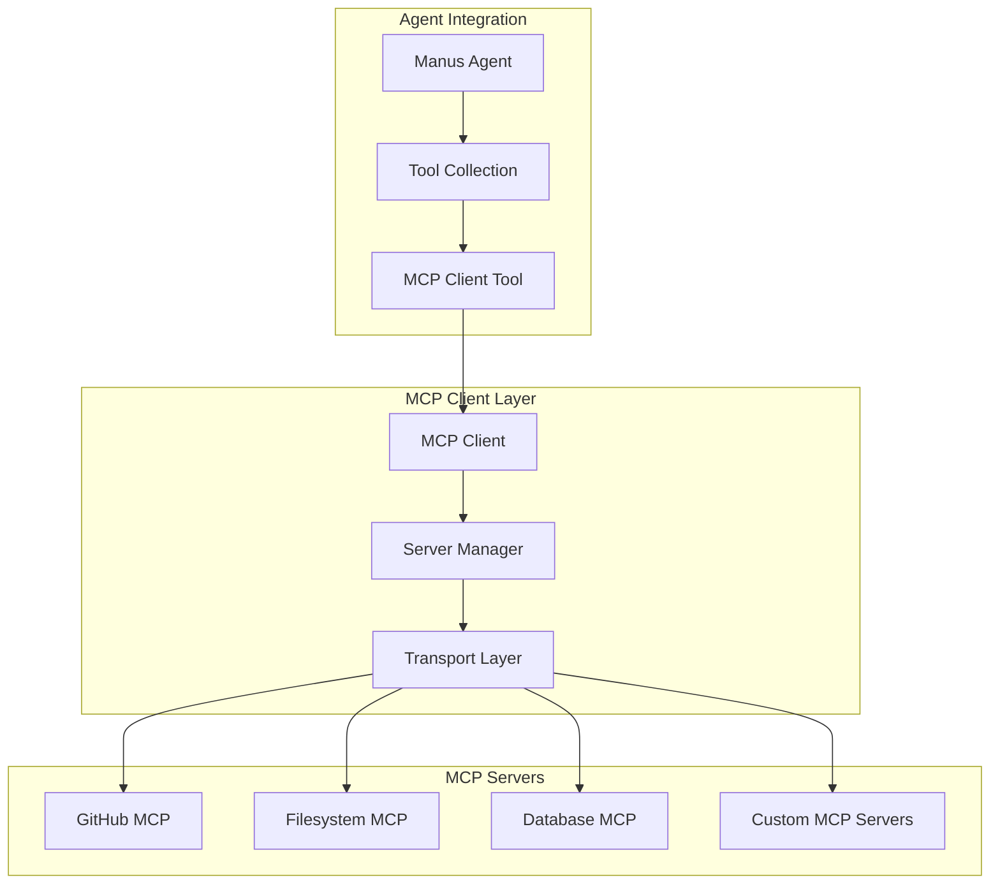

### MCP Communication Flow

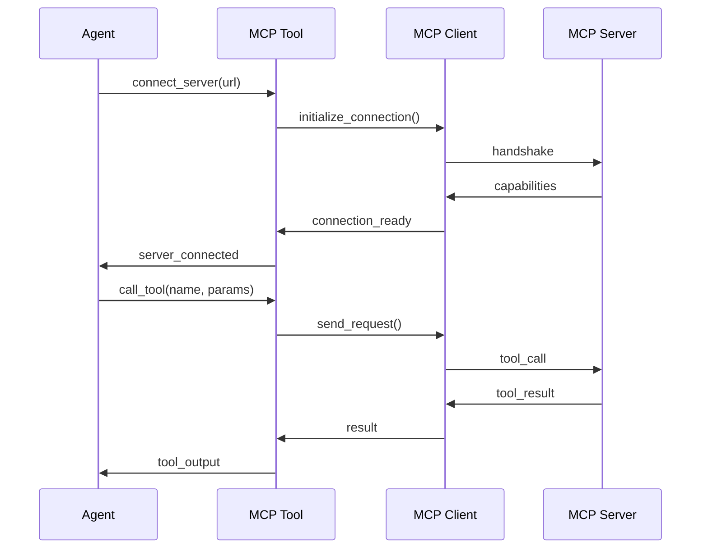

## Configuration System

### Configuration Hierarchy

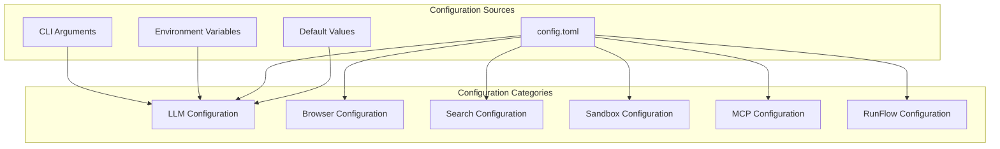

## Execution Patterns

### Single Agent Execution (main.py)

```mermaid
flowchart TD
    START([Start]) --> PARSE[Parse CLI Arguments]
    PARSE --> CREATE[Create Manus Agent]
    CREATE --> INPUT[Get User Input]
    INPUT --> VALIDATE{Validate Input}
    VALIDATE -->|Invalid| INPUT
    VALIDATE -->|Valid| RUN[Agent.run(prompt)]
    RUN --> RESULT[Process Results]
    RESULT --> CLEANUP[Agent Cleanup]
    CLEANUP --> END([End])
    
    subgraph "Agent.run() Internal Flow"
        RUN --> INIT[Initialize State]
        INIT --> LOOP{Step < Max Steps}
        LOOP -->|Yes| STEP[Execute Step]
        STEP --> UPDATE[Update Memory]
        UPDATE --> CHECK{Task Complete?}
        CHECK -->|No| LOOP
        CHECK -->|Yes| DONE[Mark Complete]
        LOOP -->|No| TIMEOUT[Max Steps Reached]
        TIMEOUT --> DONE
        DONE --> RESULT
    end
```

### Multi-Agent Flow Execution (run_flow.py)

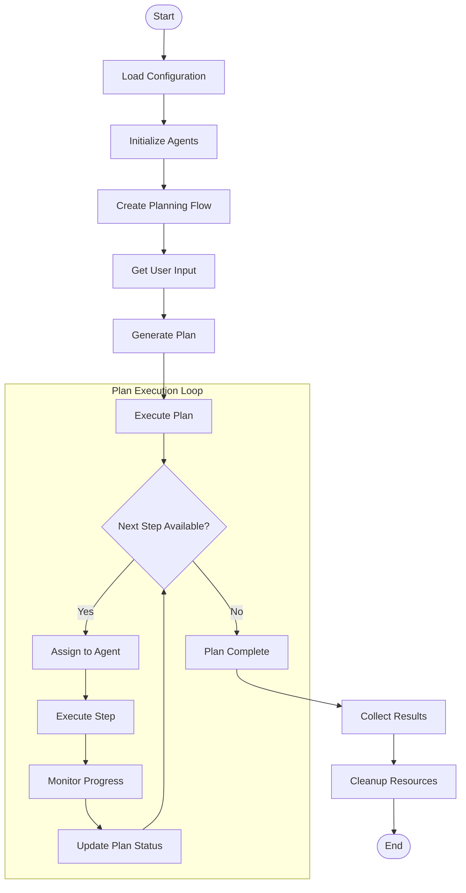

### MCP Server Execution (run_mcp.py)

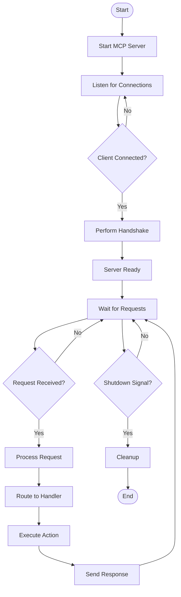

## Data Flow

### Information Flow Through the System

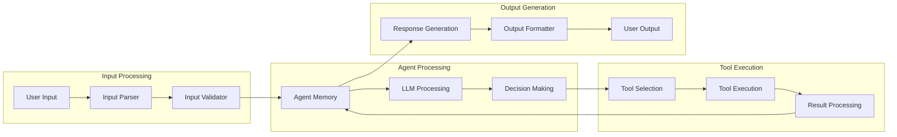

### Memory and Context Management

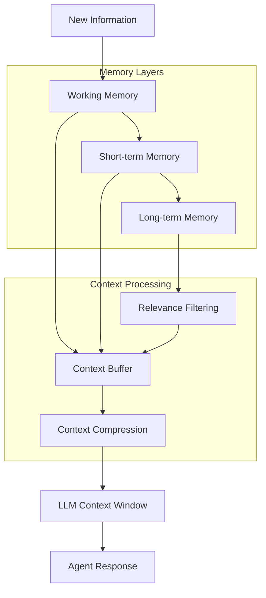

## Security and Sandboxing

### Sandbox Architecture

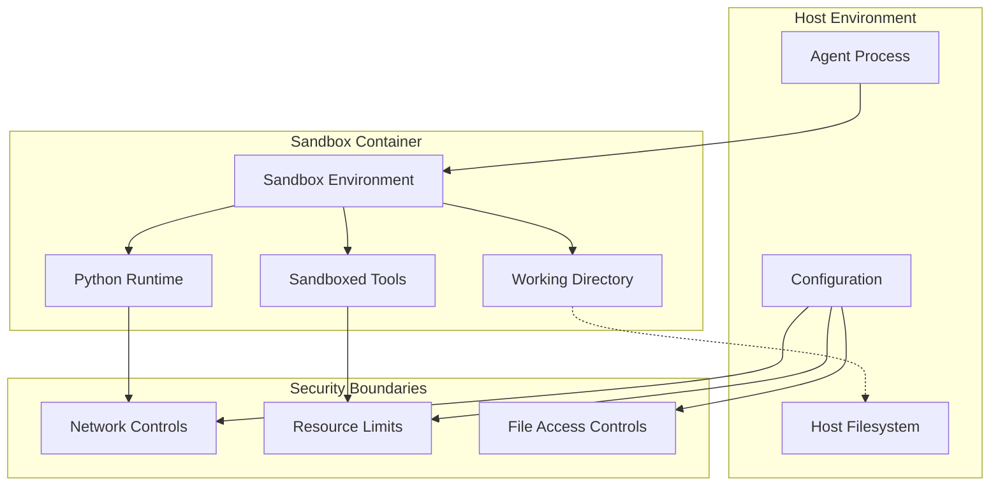

---

This architecture documentation provides a comprehensive overview of OpenManus's technical design. Each component is designed to be modular, extensible, and maintainable, allowing for easy integration of new agents, tools, and capabilities.

For specific implementation details, refer to the source code in the respective modules:
- Agents: `app/agent/`
- Tools: `app/tool/`
- Flows: `app/flow/`
- Configuration: `app/config.py`
- LLM Integration: `app/llm.py`
- MCP Support: `app/mcp/`