# Flow Management Documentation

This document provides detailed information about the OpenManus flow management system, including planning flows, multi-agent coordination, and workflow execution patterns.

## Flow Architecture Overview

### Flow Hierarchy

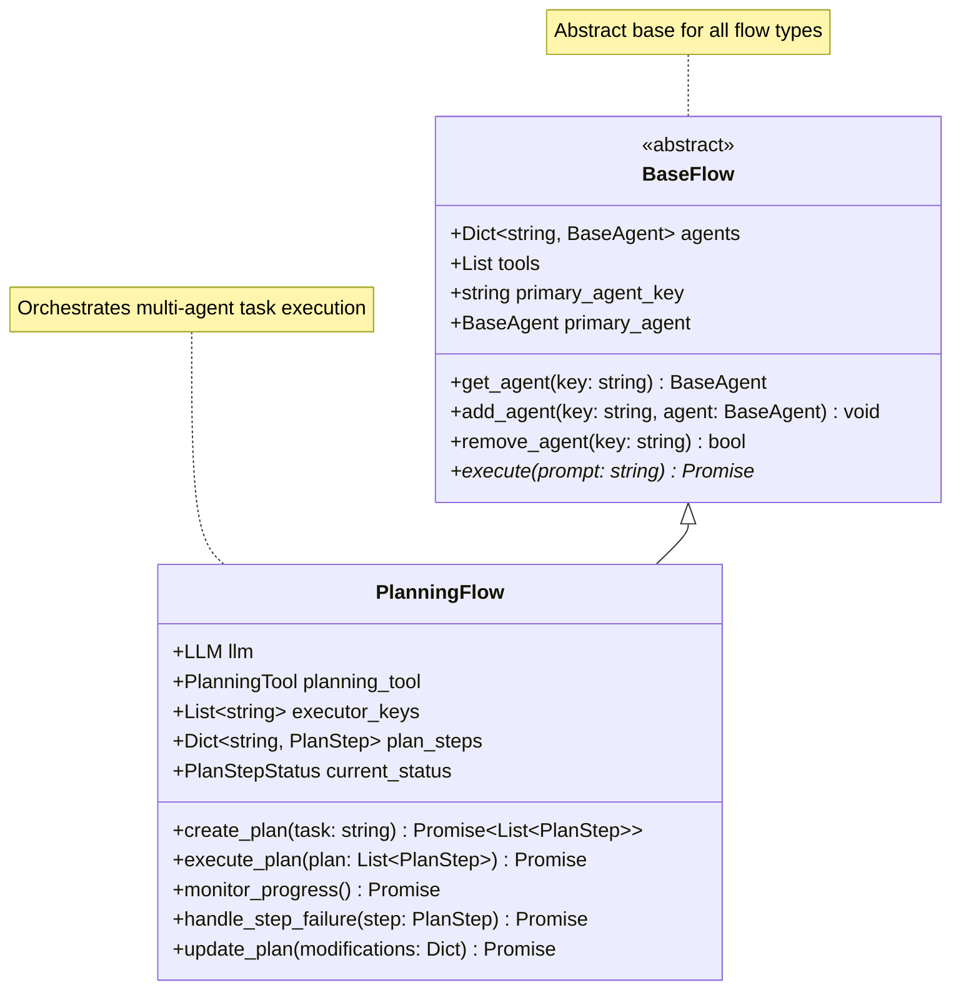
```mermaid
classDiagram
    class BaseFlow {
        <<abstract>>
        +Dict~string, BaseAgent~ agents
        +List tools
        +string primary_agent_key
        +BaseAgent primary_agent
        
        +get_agent(key: string) BaseAgent
        +add_agent(key: string, agent: BaseAgent) void
        +remove_agent(key: string) bool
        +execute(prompt: string)* Promise
    }
    
    class PlanningFlow {
        +LLM llm
        +PlanningTool planning_tool
        +List~string~ executor_keys
        +Dict~string, PlanStep~ plan_steps
        +PlanStepStatus current_status
        
        +create_plan(task: string) Promise~List~PlanStep~~
        +execute_plan(plan: List~PlanStep~) Promise
        +monitor_progress() Promise
        +handle_step_failure(step: PlanStep) Promise
        +update_plan(modifications: Dict) Promise
    }
    
    BaseFlow <|-- PlanningFlow
    
    note for BaseFlow "Abstract base for all flow types"
    note for PlanningFlow "Orchestrates multi-agent task execution"
```

### Flow Components

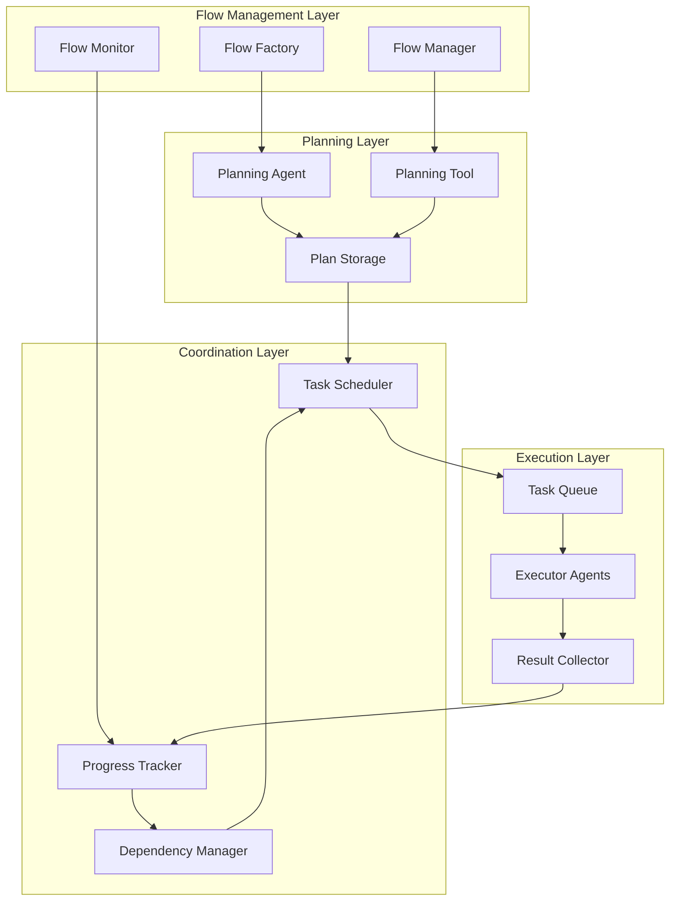
```mermaid
graph TB
    subgraph "Flow Management Layer"
        FLOW_FACTORY[Flow Factory]
        FLOW_MANAGER[Flow Manager]
        FLOW_MONITOR[Flow Monitor]
    end
    
    subgraph "Planning Layer"
        PLANNER[Planning Agent]
        PLAN_TOOL[Planning Tool]
        PLAN_STORE[Plan Storage]
    end
    
    subgraph "Execution Layer"
        EXECUTORS[Executor Agents]
        TASK_QUEUE[Task Queue]
        RESULT_COLLECTOR[Result Collector]
    end
    
    subgraph "Coordination Layer"
        SCHEDULER[Task Scheduler]
        DEPENDENCY_MGR[Dependency Manager]
        PROGRESS_TRACKER[Progress Tracker]
    end
    
    FLOW_FACTORY --> PLANNER
    FLOW_MANAGER --> PLAN_TOOL
    FLOW_MONITOR --> PROGRESS_TRACKER
    
    PLANNER --> PLAN_STORE
    PLAN_TOOL --> PLAN_STORE
    PLAN_STORE --> SCHEDULER
    
    SCHEDULER --> TASK_QUEUE
    TASK_QUEUE --> EXECUTORS
    EXECUTORS --> RESULT_COLLECTOR
    
    DEPENDENCY_MGR --> SCHEDULER
    PROGRESS_TRACKER --> DEPENDENCY_MGR
    RESULT_COLLECTOR --> PROGRESS_TRACKER
```

## Planning Flow System

### Plan Structure

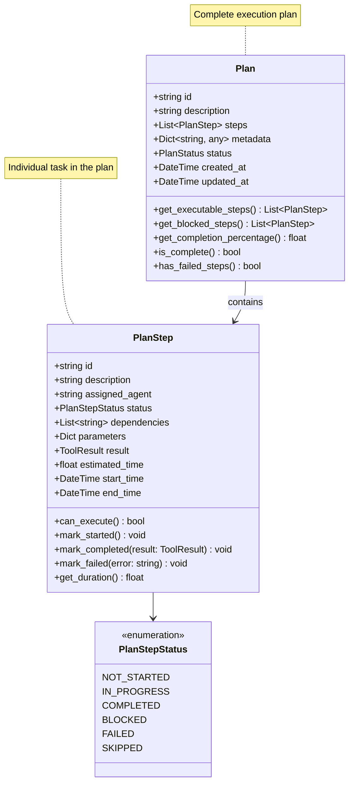
```mermaid
classDiagram
    class PlanStep {
        +string id
        +string description
        +string assigned_agent
        +PlanStepStatus status
        +List~string~ dependencies
        +Dict parameters
        +ToolResult result
        +float estimated_time
        +DateTime start_time
        +DateTime end_time
        
        +can_execute() bool
        +mark_started() void
        +mark_completed(result: ToolResult) void
        +mark_failed(error: string) void
        +get_duration() float
    }
    
    class PlanStepStatus {
        <<enumeration>>
        NOT_STARTED
        IN_PROGRESS
        COMPLETED
        BLOCKED
        FAILED
        SKIPPED
    }
    
    class Plan {
        +string id
        +string description
        +List~PlanStep~ steps
        +Dict~string, any~ metadata
        +PlanStatus status
        +DateTime created_at
        +DateTime updated_at
        
        +get_executable_steps() List~PlanStep~
        +get_blocked_steps() List~PlanStep~
        +get_completion_percentage() float
        +is_complete() bool
        +has_failed_steps() bool
    }
    
    PlanStep --> PlanStepStatus
    Plan --> PlanStep : contains
    
    note for PlanStep "Individual task in the plan"
    note for Plan "Complete execution plan"
```

### Planning Process

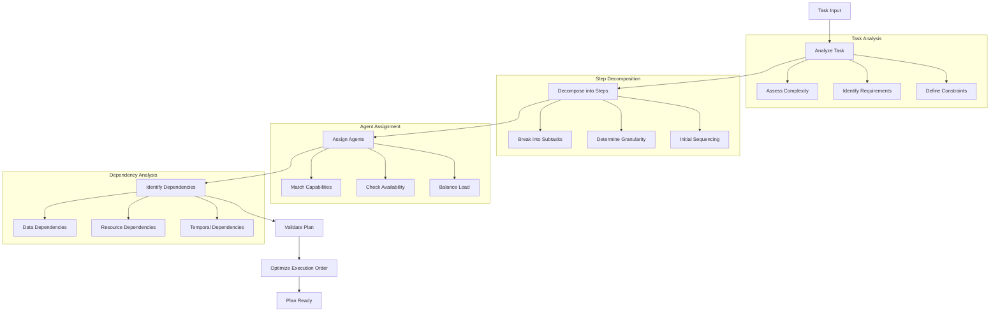
```mermaid
flowchart TD
    TASK_INPUT[Task Input] --> ANALYZE[Analyze Task]
    ANALYZE --> DECOMPOSE[Decompose into Steps]
    DECOMPOSE --> ASSIGN[Assign Agents]
    ASSIGN --> DEPENDENCIES[Identify Dependencies]
    DEPENDENCIES --> VALIDATE[Validate Plan]
    VALIDATE --> OPTIMIZE[Optimize Execution Order]
    OPTIMIZE --> PLAN_READY[Plan Ready]
    
    subgraph "Task Analysis"
        ANALYZE --> COMPLEXITY[Assess Complexity]
        ANALYZE --> REQUIREMENTS[Identify Requirements]
        ANALYZE --> CONSTRAINTS[Define Constraints]
    end
    
    subgraph "Step Decomposition"
        DECOMPOSE --> SUBTASKS[Break into Subtasks]
        DECOMPOSE --> GRANULARITY[Determine Granularity]
        DECOMPOSE --> SEQUENCING[Initial Sequencing]
    end
    
    subgraph "Agent Assignment"
        ASSIGN --> CAPABILITIES[Match Capabilities]
        ASSIGN --> AVAILABILITY[Check Availability]
        ASSIGN --> LOAD_BALANCE[Balance Load]
    end
    
    subgraph "Dependency Analysis"
        DEPENDENCIES --> DATA_DEPS[Data Dependencies]
        DEPENDENCIES --> RESOURCE_DEPS[Resource Dependencies]
        DEPENDENCIES --> TEMPORAL_DEPS[Temporal Dependencies]
    end
```

### Plan Execution Flow

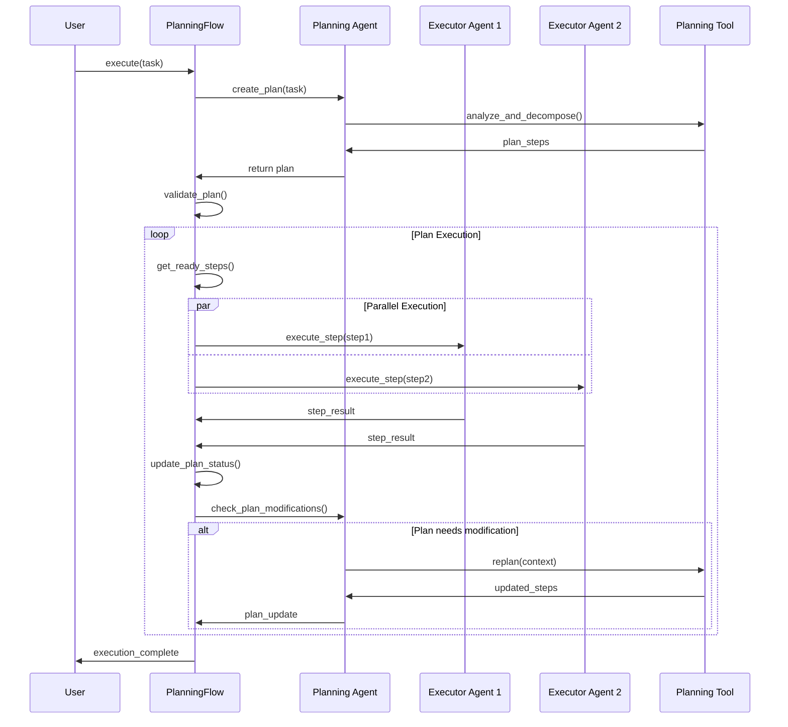
```mermaid
sequenceDiagram
    participant U as User
    participant PF as PlanningFlow
    participant PA as Planning Agent
    participant EA1 as Executor Agent 1
    participant EA2 as Executor Agent 2
    participant PT as Planning Tool
    
    U->>PF: execute(task)
    PF->>PA: create_plan(task)
    PA->>PT: analyze_and_decompose()
    PT->>PA: plan_steps
    PA->>PF: return plan
    
    PF->>PF: validate_plan()
    
    loop Plan Execution
        PF->>PF: get_ready_steps()
        
        par Parallel Execution
            PF->>EA1: execute_step(step1)
            and
            PF->>EA2: execute_step(step2)
        end
        
        EA1->>PF: step_result
        EA2->>PF: step_result
        
        PF->>PF: update_plan_status()
        PF->>PA: check_plan_modifications()
        
        alt Plan needs modification
            PA->>PT: replan(context)
            PT->>PA: updated_steps
            PA->>PF: plan_update
        end
    end
    
    PF->>U: execution_complete
```

## Multi-Agent Coordination

### Agent Coordination Patterns

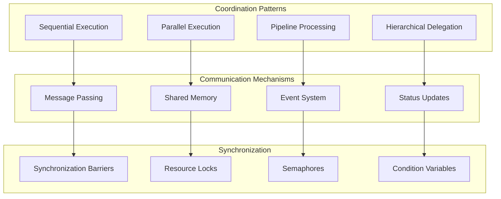
```mermaid
graph TB
    subgraph "Coordination Patterns"
        SEQUENTIAL[Sequential Execution]
        PARALLEL[Parallel Execution]
        PIPELINE[Pipeline Processing]
        HIERARCHICAL[Hierarchical Delegation]
    end
    
    subgraph "Communication Mechanisms"
        MESSAGE_PASSING[Message Passing]
        SHARED_MEMORY[Shared Memory]
        EVENT_SYSTEM[Event System]
        STATUS_UPDATES[Status Updates]
    end
    
    subgraph "Synchronization"
        BARRIERS[Synchronization Barriers]
        LOCKS[Resource Locks]
        SEMAPHORES[Semaphores]
        CONDITION_VARS[Condition Variables]
    end
    
    SEQUENTIAL --> MESSAGE_PASSING
    PARALLEL --> SHARED_MEMORY
    PIPELINE --> EVENT_SYSTEM
    HIERARCHICAL --> STATUS_UPDATES
    
    MESSAGE_PASSING --> BARRIERS
    SHARED_MEMORY --> LOCKS
    EVENT_SYSTEM --> SEMAPHORES
    STATUS_UPDATES --> CONDITION_VARS
```

### Agent Communication

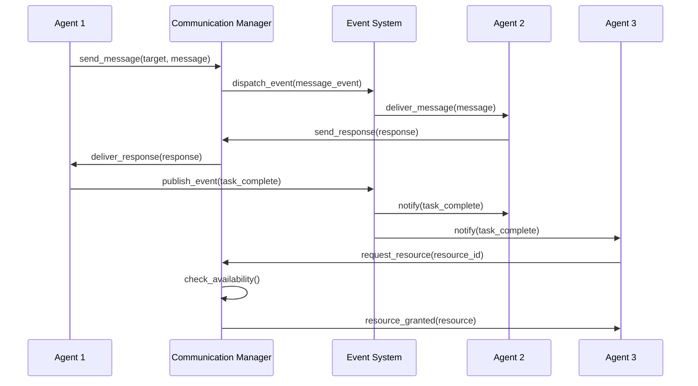
```mermaid
sequenceDiagram
    participant A1 as Agent 1
    participant CM as Communication Manager
    participant ES as Event System
    participant A2 as Agent 2
    participant A3 as Agent 3
    
    A1->>CM: send_message(target, message)
    CM->>ES: dispatch_event(message_event)
    ES->>A2: deliver_message(message)
    A2->>CM: send_response(response)
    CM->>A1: deliver_response(response)
    
    A1->>ES: publish_event(task_complete)
    ES->>A2: notify(task_complete)
    ES->>A3: notify(task_complete)
    
    A3->>CM: request_resource(resource_id)
    CM->>CM: check_availability()
    CM->>A3: resource_granted(resource)
```

### Load Balancing

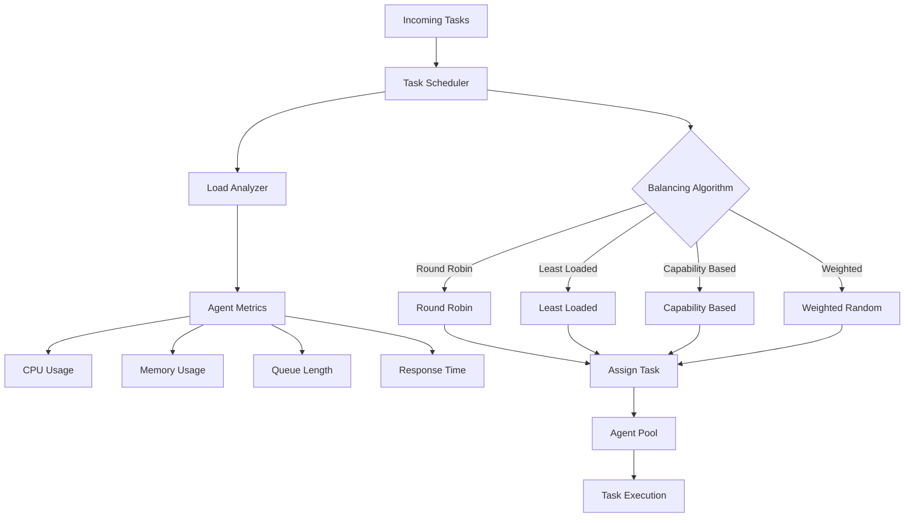
```mermaid
flowchart TD
    TASKS[Incoming Tasks] --> SCHEDULER[Task Scheduler]
    SCHEDULER --> ANALYZER[Load Analyzer]
    ANALYZER --> METRICS[Agent Metrics]
    
    METRICS --> CPU[CPU Usage]
    METRICS --> MEMORY[Memory Usage]
    METRICS --> QUEUE[Queue Length]
    METRICS --> RESPONSE[Response Time]
    
    SCHEDULER --> ALGORITHM{Balancing Algorithm}
    
    ALGORITHM -->|Round Robin| RR[Round Robin]
    ALGORITHM -->|Least Loaded| LL[Least Loaded]
    ALGORITHM -->|Capability Based| CB[Capability Based]
    ALGORITHM -->|Weighted| WR[Weighted Random]
    
    RR --> ASSIGN[Assign Task]
    LL --> ASSIGN
    CB --> ASSIGN
    WR --> ASSIGN
    
    ASSIGN --> AGENT_POOL[Agent Pool]
    AGENT_POOL --> EXECUTION[Task Execution]
```

## Workflow Patterns

### Sequential Workflow

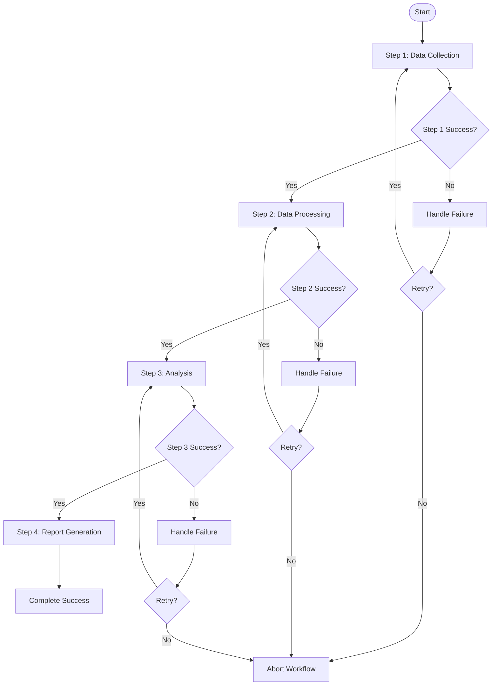
```mermaid
flowchart TD
    START([Start]) --> STEP1[Step 1: Data Collection]
    STEP1 --> CHECK1{Step 1 Success?}
    CHECK1 -->|No| FAIL1[Handle Failure]
    CHECK1 -->|Yes| STEP2[Step 2: Data Processing]
    
    STEP2 --> CHECK2{Step 2 Success?}
    CHECK2 -->|No| FAIL2[Handle Failure]
    CHECK2 -->|Yes| STEP3[Step 3: Analysis]
    
    STEP3 --> CHECK3{Step 3 Success?}
    CHECK3 -->|No| FAIL3[Handle Failure]
    CHECK3 -->|Yes| STEP4[Step 4: Report Generation]
    
    STEP4 --> SUCCESS[Complete Success]
    
    FAIL1 --> RETRY1{Retry?}
    FAIL2 --> RETRY2{Retry?}
    FAIL3 --> RETRY3{Retry?}
    
    RETRY1 -->|Yes| STEP1
    RETRY2 -->|Yes| STEP2
    RETRY3 -->|Yes| STEP3
    
    RETRY1 -->|No| ABORT[Abort Workflow]
    RETRY2 -->|No| ABORT
    RETRY3 -->|No| ABORT
```

### Parallel Workflow

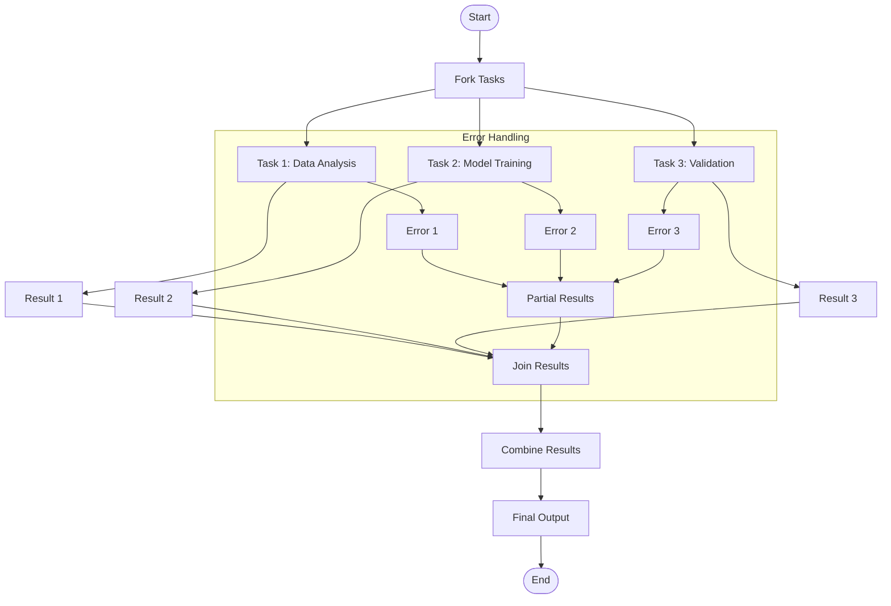
```mermaid
flowchart TD
    START([Start]) --> FORK[Fork Tasks]
    
    FORK --> TASK1[Task 1: Data Analysis]
    FORK --> TASK2[Task 2: Model Training]
    FORK --> TASK3[Task 3: Validation]
    
    TASK1 --> RESULT1[Result 1]
    TASK2 --> RESULT2[Result 2]
    TASK3 --> RESULT3[Result 3]
    
    RESULT1 --> JOIN[Join Results]
    RESULT2 --> JOIN
    RESULT3 --> JOIN
    
    JOIN --> COMBINE[Combine Results]
    COMBINE --> FINAL[Final Output]
    FINAL --> END([End])
    
    subgraph "Error Handling"
        TASK1 --> ERROR1[Error 1]
        TASK2 --> ERROR2[Error 2]
        TASK3 --> ERROR3[Error 3]
        
        ERROR1 --> PARTIAL[Partial Results]
        ERROR2 --> PARTIAL
        ERROR3 --> PARTIAL
        
        PARTIAL --> JOIN
    end
```

### Pipeline Workflow

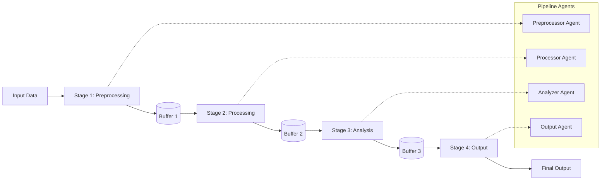
```mermaid
flowchart LR
    INPUT[Input Data] --> STAGE1[Stage 1: Preprocessing]
    STAGE1 --> BUFFER1[(Buffer 1)]
    BUFFER1 --> STAGE2[Stage 2: Processing]
    STAGE2 --> BUFFER2[(Buffer 2)]
    BUFFER2 --> STAGE3[Stage 3: Analysis]
    STAGE3 --> BUFFER3[(Buffer 3)]
    BUFFER3 --> STAGE4[Stage 4: Output]
    STAGE4 --> OUTPUT[Final Output]
    
    subgraph "Pipeline Agents"
        AGENT1[Preprocessor Agent]
        AGENT2[Processor Agent]
        AGENT3[Analyzer Agent]
        AGENT4[Output Agent]
    end
    
    STAGE1 -.-> AGENT1
    STAGE2 -.-> AGENT2
    STAGE3 -.-> AGENT3
    STAGE4 -.-> AGENT4
```

## Error Handling and Recovery

### Error Classification

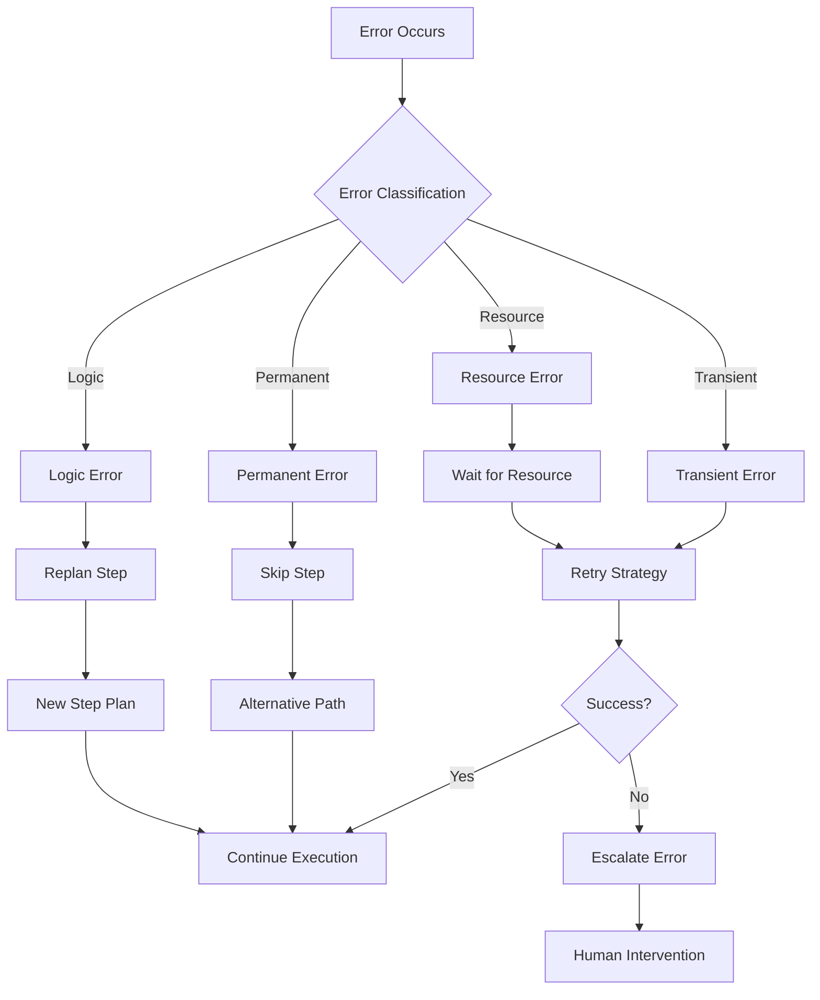
```mermaid
graph TB
    ERROR[Error Occurs] --> CLASSIFY{Error Classification}
    
    CLASSIFY -->|Transient| TRANSIENT[Transient Error]
    CLASSIFY -->|Permanent| PERMANENT[Permanent Error]
    CLASSIFY -->|Resource| RESOURCE[Resource Error]
    CLASSIFY -->|Logic| LOGIC[Logic Error]
    
    TRANSIENT --> RETRY[Retry Strategy]
    PERMANENT --> SKIP[Skip Step]
    RESOURCE --> WAIT[Wait for Resource]
    LOGIC --> REPLAN[Replan Step]
    
    RETRY --> SUCCESS{Success?}
    SUCCESS -->|Yes| CONTINUE[Continue Execution]
    SUCCESS -->|No| ESCALATE[Escalate Error]
    
    SKIP --> ALTERNATIVE[Alternative Path]
    WAIT --> RETRY
    REPLAN --> NEW_STEP[New Step Plan]
    
    ESCALATE --> HUMAN_INTERVENTION[Human Intervention]
    ALTERNATIVE --> CONTINUE
    NEW_STEP --> CONTINUE
```

### Recovery Strategies

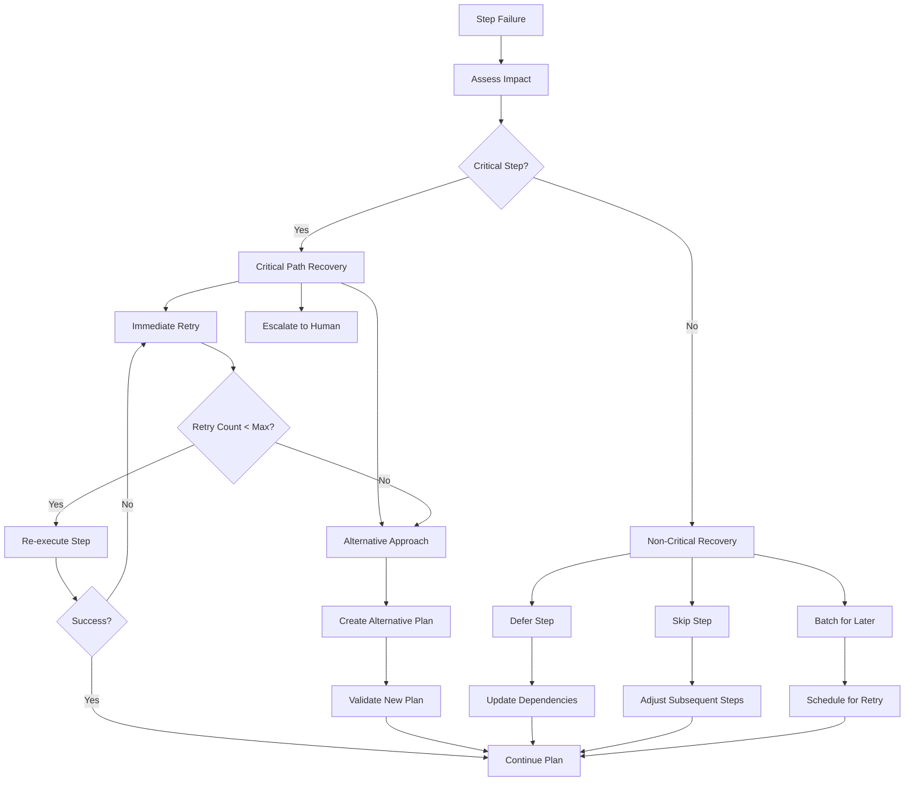
```mermaid
flowchart TD
    FAILURE[Step Failure] --> ASSESS[Assess Impact]
    ASSESS --> CRITICALITY{Critical Step?}
    
    CRITICALITY -->|Yes| CRITICAL_PATH[Critical Path Recovery]
    CRITICALITY -->|No| NON_CRITICAL[Non-Critical Recovery]
    
    CRITICAL_PATH --> IMMEDIATE[Immediate Retry]
    CRITICAL_PATH --> ALTERNATIVE[Alternative Approach]
    CRITICAL_PATH --> ESCALATE[Escalate to Human]
    
    NON_CRITICAL --> DEFER[Defer Step]
    NON_CRITICAL --> SKIP[Skip Step]
    NON_CRITICAL --> BATCH[Batch for Later]
    
    IMMEDIATE --> RETRY_COUNT{Retry Count < Max?}
    RETRY_COUNT -->|Yes| EXECUTE[Re-execute Step]
    RETRY_COUNT -->|No| ALTERNATIVE
    
    EXECUTE --> SUCCESS{Success?}
    SUCCESS -->|Yes| CONTINUE[Continue Plan]
    SUCCESS -->|No| IMMEDIATE
    
    ALTERNATIVE --> REPLAN[Create Alternative Plan]
    REPLAN --> VALIDATE[Validate New Plan]
    VALIDATE --> CONTINUE
    
    DEFER --> DEPENDENCY[Update Dependencies]
    SKIP --> ADJUST[Adjust Subsequent Steps]
    BATCH --> SCHEDULE[Schedule for Retry]
    
    DEPENDENCY --> CONTINUE
    ADJUST --> CONTINUE
    SCHEDULE --> CONTINUE
```

## Flow Configuration

### Flow Configuration Schema

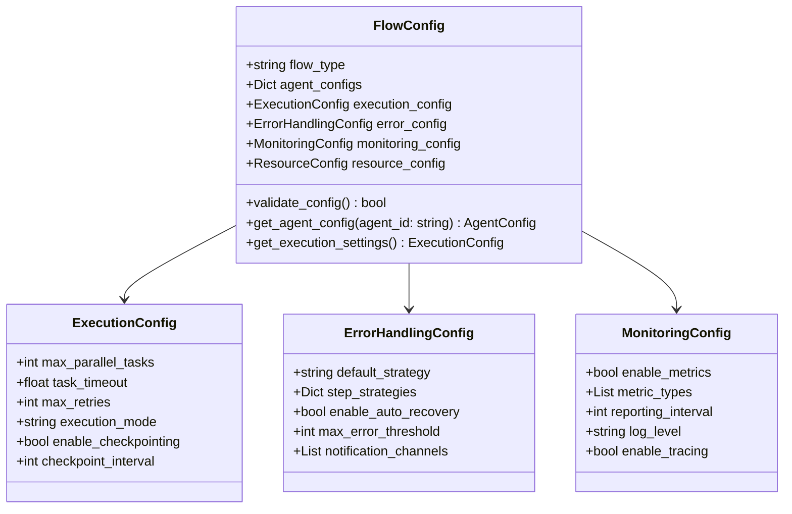
```mermaid
classDiagram
    class FlowConfig {
        +string flow_type
        +Dict agent_configs
        +ExecutionConfig execution_config
        +ErrorHandlingConfig error_config
        +MonitoringConfig monitoring_config
        +ResourceConfig resource_config
        
        +validate_config() bool
        +get_agent_config(agent_id: string) AgentConfig
        +get_execution_settings() ExecutionConfig
    }
    
    class ExecutionConfig {
        +int max_parallel_tasks
        +float task_timeout
        +int max_retries
        +string execution_mode
        +bool enable_checkpointing
        +int checkpoint_interval
    }
    
    class ErrorHandlingConfig {
        +string default_strategy
        +Dict step_strategies
        +bool enable_auto_recovery
        +int max_error_threshold
        +List notification_channels
    }
    
    class MonitoringConfig {
        +bool enable_metrics
        +List metric_types
        +int reporting_interval
        +string log_level
        +bool enable_tracing
    }
    
    FlowConfig --> ExecutionConfig
    FlowConfig --> ErrorHandlingConfig
    FlowConfig --> MonitoringConfig
```

### Flow Factory Pattern

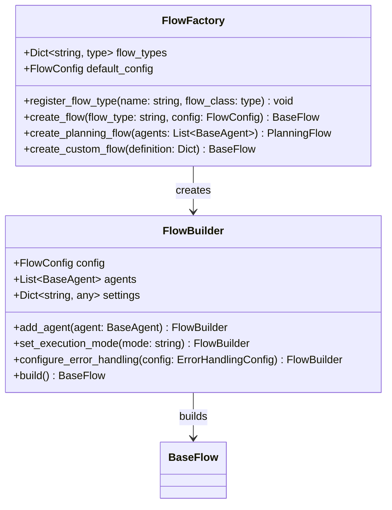
```mermaid
classDiagram
    class FlowFactory {
        +Dict~string, type~ flow_types
        +FlowConfig default_config
        
        +register_flow_type(name: string, flow_class: type) void
        +create_flow(flow_type: string, config: FlowConfig) BaseFlow
        +create_planning_flow(agents: List~BaseAgent~) PlanningFlow
        +create_custom_flow(definition: Dict) BaseFlow
    }
    
    class FlowBuilder {
        +FlowConfig config
        +List~BaseAgent~ agents
        +Dict~string, any~ settings
        
        +add_agent(agent: BaseAgent) FlowBuilder
        +set_execution_mode(mode: string) FlowBuilder
        +configure_error_handling(config: ErrorHandlingConfig) FlowBuilder
        +build() BaseFlow
    }
    
    FlowFactory --> FlowBuilder : creates
    FlowBuilder --> BaseFlow : builds
```

## Performance Optimization

### Flow Optimization Strategies

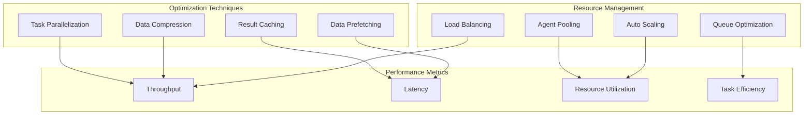
```mermaid
graph TB
    subgraph "Optimization Techniques"
        PARALLELIZATION[Task Parallelization]
        CACHING[Result Caching]
        PREFETCHING[Data Prefetching]
        COMPRESSION[Data Compression]
    end
    
    subgraph "Resource Management"
        POOLING[Agent Pooling]
        QUEUE_OPT[Queue Optimization]
        LOAD_BALANCE[Load Balancing]
        SCALING[Auto Scaling]
    end
    
    subgraph "Performance Metrics"
        THROUGHPUT[Throughput]
        LATENCY[Latency]
        UTILIZATION[Resource Utilization]
        EFFICIENCY[Task Efficiency]
    end
    
    PARALLELIZATION --> THROUGHPUT
    CACHING --> LATENCY
    PREFETCHING --> LATENCY
    COMPRESSION --> THROUGHPUT
    
    POOLING --> UTILIZATION
    QUEUE_OPT --> EFFICIENCY
    LOAD_BALANCE --> THROUGHPUT
    SCALING --> UTILIZATION
```

### Resource Optimization

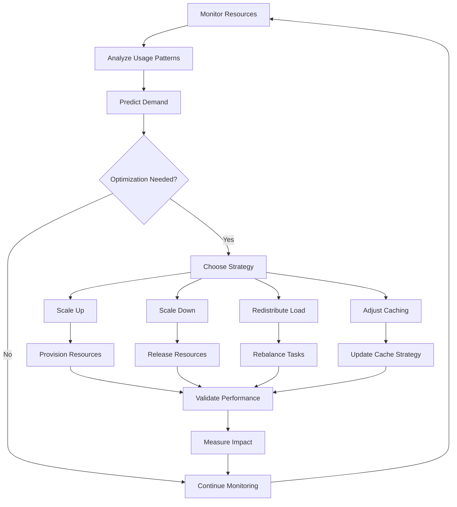
```mermaid
flowchart TD
    MONITOR[Monitor Resources] --> ANALYZE[Analyze Usage Patterns]
    ANALYZE --> PREDICT[Predict Demand]
    PREDICT --> OPTIMIZE{Optimization Needed?}
    
    OPTIMIZE -->|Yes| STRATEGY[Choose Strategy]
    OPTIMIZE -->|No| CONTINUE[Continue Monitoring]
    
    STRATEGY --> SCALE_UP[Scale Up]
    STRATEGY --> SCALE_DOWN[Scale Down]
    STRATEGY --> REDISTRIBUTE[Redistribute Load]
    STRATEGY --> CACHE_ADJUST[Adjust Caching]
    
    SCALE_UP --> PROVISION[Provision Resources]
    SCALE_DOWN --> RELEASE[Release Resources]
    REDISTRIBUTE --> REBALANCE[Rebalance Tasks]
    CACHE_ADJUST --> UPDATE_CACHE[Update Cache Strategy]
    
    PROVISION --> VALIDATE[Validate Performance]
    RELEASE --> VALIDATE
    REBALANCE --> VALIDATE
    UPDATE_CACHE --> VALIDATE
    
    VALIDATE --> MEASURE[Measure Impact]
    MEASURE --> CONTINUE
    CONTINUE --> MONITOR
```

## Monitoring and Observability

### Flow Monitoring

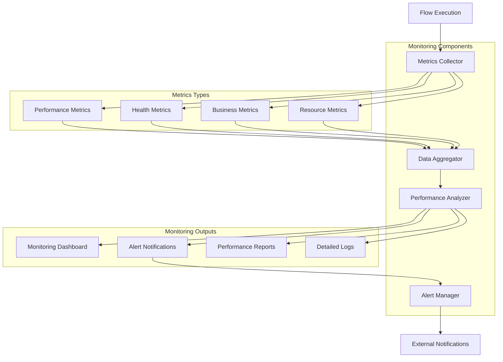
```mermaid
graph TB
    subgraph "Monitoring Components"
        COLLECTOR[Metrics Collector]
        AGGREGATOR[Data Aggregator]
        ANALYZER[Performance Analyzer]
        ALERTER[Alert Manager]
    end
    
    subgraph "Metrics Types"
        PERFORMANCE[Performance Metrics]
        HEALTH[Health Metrics]
        BUSINESS[Business Metrics]
        RESOURCE[Resource Metrics]
    end
    
    subgraph "Monitoring Outputs"
        DASHBOARD[Monitoring Dashboard]
        ALERTS[Alert Notifications]
        REPORTS[Performance Reports]
        LOGS[Detailed Logs]
    end
    
    FLOW_EXECUTION[Flow Execution] --> COLLECTOR
    COLLECTOR --> PERFORMANCE
    COLLECTOR --> HEALTH
    COLLECTOR --> BUSINESS
    COLLECTOR --> RESOURCE
    
    PERFORMANCE --> AGGREGATOR
    HEALTH --> AGGREGATOR
    BUSINESS --> AGGREGATOR
    RESOURCE --> AGGREGATOR
    
    AGGREGATOR --> ANALYZER
    ANALYZER --> DASHBOARD
    ANALYZER --> ALERTS
    ANALYZER --> REPORTS
    ANALYZER --> LOGS
    
    ALERTS --> ALERTER
    ALERTER --> NOTIFICATION[External Notifications]
```

### Observability Stack

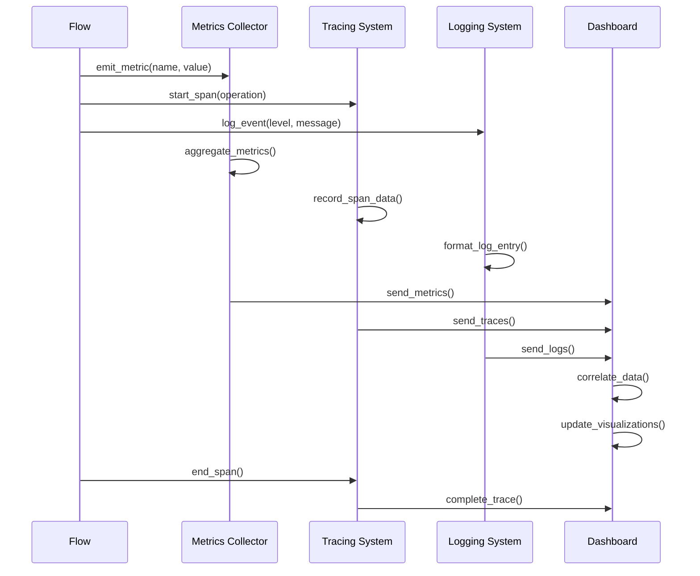
```mermaid
sequenceDiagram
    participant F as Flow
    participant M as Metrics Collector
    participant T as Tracing System
    participant L as Logging System
    participant D as Dashboard
    
    F->>M: emit_metric(name, value)
    F->>T: start_span(operation)
    F->>L: log_event(level, message)
    
    M->>M: aggregate_metrics()
    T->>T: record_span_data()
    L->>L: format_log_entry()
    
    M->>D: send_metrics()
    T->>D: send_traces()
    L->>D: send_logs()
    
    D->>D: correlate_data()
    D->>D: update_visualizations()
    
    F->>T: end_span()
    T->>D: complete_trace()
```

This flow management documentation provides comprehensive coverage of the OpenManus flow system, from basic concepts to advanced orchestration patterns. The system is designed to handle complex multi-agent workflows while maintaining flexibility and reliability.