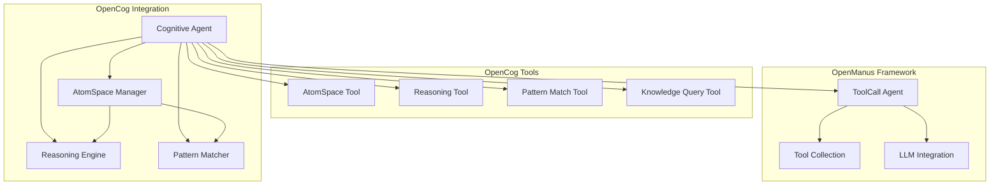

# OpenCog Integration with OpenManus Framework

This document describes the integration of OpenCog systems with the OpenManus framework, providing symbolic AI capabilities including knowledge representation, reasoning, and pattern matching.

## Overview

The OpenCog integration adds advanced symbolic AI capabilities to OpenManus agents through:

- **AtomSpace**: Knowledge representation using atoms, links, and truth values
- **Reasoning Engine**: Forward/backward chaining with symbolic inference rules
- **Pattern Matcher**: Advanced pattern matching and similarity detection
- **Cognitive Agent**: Agent that combines all OpenCog systems with OpenManus tools

## Architecture



## Components

### AtomSpace Manager

The AtomSpace provides knowledge representation using a hypergraph of atoms:

- **Nodes**: Represent concepts and predicates
- **Links**: Represent relationships between atoms
- **Truth Values**: Assign strength and confidence to atoms

```python
from app.opencog.atomspace import AtomSpaceManager

atomspace = AtomSpaceManager()

# Add concepts
ai_id = atomspace.add_concept("Artificial Intelligence")
ml_id = atomspace.add_concept("Machine Learning")

# Add relationships
inheritance_id = atomspace.add_inheritance("Machine Learning", "Artificial Intelligence")

# Add facts
fact_id = atomspace.add_evaluation("learns_from", "Machine Learning", "data")
```

### Reasoning Engine

Provides symbolic reasoning capabilities:

```python
from app.opencog.reasoning import ReasoningEngine

reasoning = ReasoningEngine(atomspace=atomspace)

# Add default reasoning rules
reasoning.add_default_rules()

# Perform forward chaining
inferences = reasoning.forward_chain(max_inferences=10)

# Query knowledge
results = reasoning.query_knowledge("artificial intelligence")
```

### Pattern Matcher

Advanced pattern matching for knowledge queries:

```python
from app.opencog.pattern_matcher import PatternMatcher

matcher = PatternMatcher(atomspace=atomspace)

# Create patterns with variables
pattern = matcher.create_pattern(
    atom_type="ConceptNode",
    name=matcher.create_variable("X", type_constraint="ConceptNode")
)

# Find matches
matches = matcher.match_pattern(pattern)

# Find similar atoms
similar = matcher.find_similar_atoms(ai_id, similarity_threshold=0.7)
```

### Cognitive Agent

Main agent class that integrates all OpenCog systems:

```python
from app.opencog.cognitive_agent import CognitiveAgent

agent = CognitiveAgent(
    enable_auto_reasoning=True,
    knowledge_persistence=True
)

# Add knowledge
agent.add_knowledge("concept", "Neural Networks")
agent.add_knowledge("relation", "Deep Learning", object_="Machine Learning")
agent.add_knowledge("fact", "Neural Networks", "inspired_by", "biological_neurons")

# Query with reasoning
results = agent.query_knowledge("neural networks")

# Run as agent
await agent.run("Explain the relationship between AI and machine learning")
```

## Tools Integration

OpenCog systems are exposed through OpenManus tools:

### AtomSpace Tool

Manipulate the knowledge base:

```bash
# Add concepts
atomspace add_concept concept="Artificial Intelligence"

# Add relationships
atomspace add_relation subject="Machine Learning" object="Artificial Intelligence"

# Query knowledge
atomspace query query_text="AI"

# List atoms by type
atomspace list_atoms atom_type="ConceptNode"
```

### Reasoning Tool

Perform symbolic reasoning:

```bash
# Forward chaining
reasoning forward_chain max_inferences=10

# Add custom rules
reasoning add_rule rule_name="custom" premises='[...]' conclusion='{...}'

# Query with reasoning
reasoning query_knowledge query="machine learning"
```

### Pattern Match Tool

Advanced pattern matching:

```bash
# Match patterns
pattern_match match_query query="ConceptNode(AI)"

# Find similar atoms
pattern_match find_similar target_atom_id=123 similarity_threshold=0.8

# Find connected atoms
pattern_match find_connected target_atom_id=123 max_depth=3
```

### Knowledge Query Tool

High-level knowledge analysis:

```bash
# Natural language queries
knowledge_query query query_text="What is artificial intelligence?"

# Analyze concepts
knowledge_query analyze_concept concept="Machine Learning"

# Get insights
knowledge_query get_insights insight_type="patterns"

# Summarize knowledge
knowledge_query summarize_knowledge topic="AI"
```

## Usage Examples

### Basic Knowledge Building

```python
import asyncio
from app.opencog.cognitive_agent import CognitiveAgent

async def main():
    agent = CognitiveAgent()
    
    # Build knowledge about AI
    agent.add_knowledge("concept", "Artificial Intelligence")
    agent.add_knowledge("concept", "Machine Learning")
    agent.add_knowledge("concept", "Deep Learning")
    
    # Add relationships
    agent.add_knowledge("relation", "Machine Learning", object_="Artificial Intelligence")
    agent.add_knowledge("relation", "Deep Learning", object_="Machine Learning")
    
    # Add facts
    agent.add_knowledge("fact", "Machine Learning", "learns_from", "data")
    agent.add_knowledge("fact", "Deep Learning", "uses", "neural_networks")
    
    # Query the knowledge
    results = agent.query_knowledge("machine learning")
    print(f"Found {len(results)} related items")

asyncio.run(main())
```

### Running as Agent

```python
import asyncio
from app.opencog.cognitive_agent import CognitiveAgent

async def main():
    agent = CognitiveAgent()
    
    # The agent will use OpenCog tools to answer
    await agent.run("Build a knowledge base about programming languages and explain the relationships between Python, object-oriented programming, and machine learning")

asyncio.run(main())
```

### Command Line Usage

```bash
# Run cognitive agent with demonstration
python run_cognitive_agent.py --demo

# Run with specific prompt
python run_cognitive_agent.py --prompt "Explain artificial intelligence using symbolic reasoning"

# Persist knowledge between sessions
python run_cognitive_agent.py --persist-knowledge --prompt "Build knowledge about AI"

# Load/save knowledge
python run_cognitive_agent.py --load-knowledge ai_knowledge.json --prompt "Query AI knowledge"
python run_cognitive_agent.py --save-knowledge ai_knowledge.json
```

## Configuration

The Cognitive Agent can be configured with various options:

```python
agent = CognitiveAgent(
    enable_auto_reasoning=True,        # Automatically run reasoning after knowledge updates
    max_reasoning_iterations=5,        # Maximum reasoning iterations per step
    knowledge_persistence=True,        # Persist knowledge between runs
    max_results=20                     # Maximum query results
)
```

## Advanced Features

### Custom Reasoning Rules

Add domain-specific reasoning rules:

```python
# Rule: If X is a type of Y, and Y has property P, then X has property P
premises = [
    {"type": "InheritanceLink", "outgoing": ["$X", "$Y"]},
    {"type": "EvaluationLink", "outgoing": ["$P", "$Y"]}
]
conclusion = {"type": "EvaluationLink", "outgoing": ["$P", "$X"]}

agent.reasoning_engine.add_rule("property_inheritance", premises, conclusion, 0.9)
```

### Truth Value Reasoning

Work with uncertain knowledge:

```python
# Add knowledge with uncertainty
agent.add_knowledge(
    "fact", "AI", "will_achieve", "AGI",
    truth_value={"strength": 0.7, "confidence": 0.5}
)

# Reasoning will propagate uncertainty
inferences = agent.reasoning_engine.forward_chain()
```

### Pattern-Based Queries

Use structural patterns for complex queries:

```python
# Find all inheritance relationships
pattern = {
    "type": "InheritanceLink",
    "outgoing": [
        {"variable": {"name": "child", "type_constraint": "ConceptNode"}},
        {"variable": {"name": "parent", "type_constraint": "ConceptNode"}}
    ]
}

matches = agent.pattern_matcher.match_pattern(pattern)
```

## Performance Considerations

- **AtomSpace Size**: Monitor atom count for memory usage
- **Reasoning Cycles**: Limit forward chaining iterations
- **Pattern Complexity**: Simple patterns match faster
- **Truth Value Calculations**: Can be computationally expensive

## Testing

Run the test suite:

```bash
# Test AtomSpace
python -m pytest tests/opencog/test_atomspace.py

# Test Reasoning
python -m pytest tests/opencog/test_reasoning.py

# Test all OpenCog components
python -m pytest tests/opencog/
```

## Future Enhancements

Potential areas for expansion:

1. **PLN Integration**: Full Probabilistic Logic Networks implementation
2. **MOSES Integration**: Program learning and evolutionary optimization  
3. **Attention Allocation**: Economic attention allocation mechanisms
4. **Distributed AtomSpace**: Multi-node knowledge sharing
5. **Visualization**: Graph visualization of knowledge structures
6. **Natural Language Interface**: Better NL to symbolic conversion

## Troubleshooting

Common issues and solutions:

### Memory Usage
- Monitor AtomSpace size with `get_cognitive_status()`
- Clear AtomSpace periodically with `atomspace.clear()`
- Limit reasoning iterations

### Performance
- Use type constraints in patterns to reduce search space
- Cache frequently used patterns
- Limit truth value precision

### Knowledge Consistency
- Use `check_consistency` operation to detect conflicts
- Review low-confidence atoms
- Validate inheritance hierarchies

## References

- [OpenCog Official Documentation](https://wiki.opencog.org/)
- [OpenManus Agent Framework](./AGENT_FRAMEWORK.md)
- [Pattern Matching Theory](https://wiki.opencog.org/w/Pattern_matching)
- [Probabilistic Logic Networks](https://wiki.opencog.org/w/PLN)