# OpenManus Documentation Index

Welcome to the OpenManus technical documentation. This index provides a comprehensive guide to understanding and working with the OpenManus AI agent framework.

## 📋 Documentation Overview

### Core Architecture
- **[Technical Architecture](ARCHITECTURE.md)** - Complete system overview with Mermaid diagrams
- **[Agent Framework](AGENT_FRAMEWORK.md)** - Detailed agent system documentation
- **[Tool System](TOOL_SYSTEM.md)** - Comprehensive tool framework guide
- **[Flow Management](FLOW_MANAGEMENT.md)** - Multi-agent coordination and workflow patterns

## 🎯 Quick Navigation

### For Developers
- [Getting Started](#getting-started)
- [Agent Development](#agent-development)
- [Tool Development](#tool-development)
- [Flow Configuration](#flow-configuration)
- [API Reference](#api-reference)

### For System Architects
- [System Overview](#system-overview)
- [Component Interactions](#component-interactions)
- [Scalability Patterns](#scalability-patterns)
- [Security Architecture](#security-architecture)

### For Users
- [User Guides](#user-guides)
- [Configuration Examples](#configuration-examples)
- [Troubleshooting](#troubleshooting)
- [Best Practices](#best-practices)

## 🚀 Getting Started

### System Requirements
- Python 3.12+
- Docker (for sandboxed execution)
- Modern web browser (for browser automation)

### Quick Setup
```bash
# Clone the repository
git clone https://github.com/FoundationAgents/OpenManus.git
cd OpenManus

# Install dependencies
pip install -r requirements.txt

# Configure the system
cp config/config.example.toml config/config.toml
# Edit config.toml with your API keys

# Run OpenManus
python main.py
```

## 🏗️ System Overview

OpenManus is built on a modular architecture with four main layers:

```mermaid
graph TB
    subgraph "🎯 Application Layer"
        MAIN[main.py - Single Agent]
        FLOW[run_flow.py - Multi-Agent]
        MCP[run_mcp.py - MCP Server]
    end
    
    subgraph "🤖 Agent Layer"
        MANUS[Manus - General Purpose]
        SWE[SWE - Software Engineering]
        BROWSER[Browser - Web Automation]
        DATA[Data Analysis]
    end
    
    subgraph "🛠️ Tool Layer"
        PYTHON[Python Execution]
        FILES[File Operations]
        WEB[Web Search & Browser]
        CHARTS[Data Visualization]
        MCP_TOOLS[MCP Tools]
    end
    
    subgraph "⚡ Infrastructure Layer"
        LLM[LLM Providers]
        CONFIG[Configuration]
        SANDBOX[Sandbox Environment]
        MEMORY[Memory Management]
    end
    
    MAIN --> MANUS
    FLOW --> MANUS
    FLOW --> SWE
    FLOW --> BROWSER
    FLOW --> DATA
    MCP --> MANUS
    
    MANUS --> PYTHON
    MANUS --> FILES
    MANUS --> WEB
    MANUS --> CHARTS
    MANUS --> MCP_TOOLS
    
    PYTHON --> SANDBOX
    FILES --> CONFIG
    WEB --> CONFIG
    CHARTS --> MEMORY
    MCP_TOOLS --> LLM
```



## 🤖 Agent Development

### Creating Custom Agents

```python
from app.agent.toolcall import ToolCallAgent
from app.tool import ToolCollection

class MyCustomAgent(ToolCallAgent):
    name = "CustomAgent"
    description = "Specialized agent for specific tasks"
    
    # Configure available tools
    available_tools = ToolCollection(
        # Add your tools here
    )
    
    # Custom system prompt
    system_prompt = "You are a specialized agent that..."
    
    async def custom_behavior(self):
        """Implement custom agent behavior"""
        pass
```

### Agent Lifecycle

1. **Initialization** - Agent setup and tool registration
2. **Planning** - Task analysis and step planning
3. **Execution** - Tool execution and result processing
4. **Monitoring** - Progress tracking and error handling
5. **Completion** - Result compilation and cleanup

## 🛠️ Tool Development

### Tool Architecture

All tools inherit from `BaseTool` and implement the `execute` method:

```python
from app.tool.base import BaseTool, ToolResult

class MyTool(BaseTool):
    name = "my_tool"
    description = "Tool description"
    parameters = {
        "type": "object",
        "properties": {
            "param1": {"type": "string", "description": "Parameter description"}
        },
        "required": ["param1"]
    }
    
    async def execute(self, param1: str) -> ToolResult:
        try:
            result = self.perform_operation(param1)
            return ToolResult(output=result)
        except Exception as e:
            return ToolResult(error=str(e))
```

### Available Tool Categories

| Category | Tools | Description |
|----------|-------|-------------|
| **Execution** | Python, Bash, Docker | Code and command execution |
| **File System** | File Reader, Writer, Editor | File operations |
| **Web & Browser** | Browser automation, Web search | Web interaction |
| **Data & Analytics** | Chart visualization, Data processing | Data analysis |
| **Communication** | Ask Human, Notifications | User interaction |
| **External** | MCP Client, API tools | External integrations |

## 🔄 Flow Configuration

### Multi-Agent Workflows

Configure multi-agent workflows in `config.toml`:

```toml
[runflow]
use_data_analysis_agent = true
use_swe_agent = true
use_browser_agent = false

[agents.data_analysis]
enabled_tools = ["python_execute", "chart_visualization"]
max_steps = 15

[agents.swe]
enabled_tools = ["str_replace_editor", "python_execute"]
workspace_root = "./workspace"
```

### Flow Types

- **Sequential Flow** - Steps execute one after another
- **Parallel Flow** - Steps execute simultaneously
- **Pipeline Flow** - Data flows through processing stages
- **Hierarchical Flow** - Nested sub-workflows

## 🔧 API Reference

### Core Classes

| Class | Purpose | Key Methods |
|-------|---------|-------------|
| `BaseAgent` | Agent foundation | `run()`, `step()`, `cleanup()` |
| `ToolCallAgent` | Tool-enabled agent | `execute_tool()`, `get_tool_output()` |
| `BaseTool` | Tool foundation | `execute()`, `to_param()` |
| `ToolCollection` | Tool management | `get_tool()`, `list_tools()` |
| `BaseFlow` | Flow foundation | `execute()`, `get_agent()` |
| `PlanningFlow` | Multi-agent orchestration | `create_plan()`, `execute_plan()` |

### Configuration API

```python
from app.config import config

# Access LLM configuration
llm_config = config.llm

# Access tool settings
tool_config = config.get_tool_config("python_execute")

# Access browser settings
browser_config = config.browser
```

## 🔐 Security Architecture

### Sandbox Environment

- **Containerized Execution** - Python code runs in Docker containers
- **Resource Limits** - Memory, CPU, and time constraints
- **Network Isolation** - Controlled network access
- **File System Restrictions** - Limited file system access

### Permission Model


## 📊 Performance & Monitoring

### Key Metrics

- **Throughput** - Tasks completed per minute
- **Latency** - Average response time
- **Success Rate** - Percentage of successful executions
- **Resource Utilization** - CPU, memory, and network usage

### Optimization Strategies

- **Parallel Execution** - Run independent tasks simultaneously
- **Caching** - Cache frequently used results
- **Load Balancing** - Distribute tasks across agents
- **Resource Pooling** - Reuse expensive resources

## 🔌 External Integrations

### MCP (Model Context Protocol)

OpenManus supports MCP for external tool integration:

```python
# Connect to MCP server
await agent.connect_mcp_server("stdio:///path/to/mcp/server")

# Use MCP tools
result = await agent.execute_tool("mcp_tool", {
    "server_id": "github",
    "tool_name": "create_issue",
    "args": {"title": "New issue", "body": "Description"}
})
```

### Supported MCP Servers

- **GitHub** - Repository operations
- **Filesystem** - Advanced file operations  
- **Database** - Database queries and operations
- **Custom** - Build your own MCP servers

## 🛡️ Best Practices

### Agent Design

1. **Single Responsibility** - Each agent should have a clear purpose
2. **Tool Selection** - Only include necessary tools
3. **Error Handling** - Implement robust error recovery
4. **Resource Management** - Clean up resources properly

### Tool Development

1. **Parameter Validation** - Validate all inputs
2. **Error Messages** - Provide clear error descriptions
3. **Documentation** - Document parameters and behavior
4. **Testing** - Write comprehensive tests

### Flow Design

1. **Task Decomposition** - Break complex tasks into steps
2. **Dependency Management** - Handle step dependencies
3. **Failure Recovery** - Plan for step failures
4. **Progress Tracking** - Monitor execution progress

## 🔍 Troubleshooting

### Common Issues

| Issue | Symptoms | Solution |
|-------|----------|----------|
| **Agent Timeout** | Tasks never complete | Check max_steps and task complexity |
| **Tool Errors** | Tools fail repeatedly | Verify tool configuration and permissions |
| **Memory Issues** | High memory usage | Optimize context management and caching |
| **Network Problems** | Web tools fail | Check network connectivity and proxies |

### Debug Mode

Enable detailed logging for troubleshooting:

```python
import logging
logging.basicConfig(level=logging.DEBUG)
```

### Performance Profiling

Monitor performance with built-in metrics:

```python
from app.logger import logger

# Enable performance tracking
logger.info("Task started", extra={"task_id": "123"})
# ... task execution
logger.info("Task completed", extra={"task_id": "123", "duration": 45.2})
```

## 📚 Additional Resources

### Community

- **GitHub Repository** - [OpenManus](https://github.com/FoundationAgents/OpenManus)
- **Discord Server** - [Join our community](https://discord.gg/DYn29wFk9z)
- **Documentation** - [Official docs](https://github.com/FoundationAgents/OpenManus/docs)

### Examples

- **Basic Usage** - `examples/basic_usage.py`
- **Custom Agents** - `examples/custom_agent.py`
- **Multi-Agent Flows** - `examples/multi_agent_flow.py`
- **Tool Development** - `examples/custom_tool.py`

### Contributing

1. **Fork** the repository
2. **Create** a feature branch
3. **Implement** your changes
4. **Test** thoroughly
5. **Submit** a pull request

---

This documentation is continuously updated. For the latest information, please refer to the [GitHub repository](https://github.com/FoundationAgents/OpenManus).