# Tool System Documentation

This document provides comprehensive information about the OpenManus tool system, including tool architecture, available tools, and extension patterns.

## Tool Architecture Overview

### Tool Hierarchy

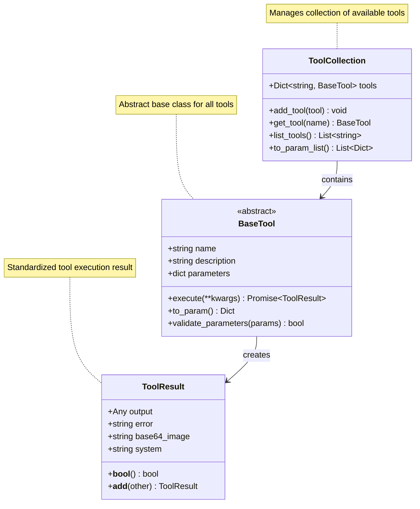
```mermaid
classDiagram
    class BaseTool {
        <<abstract>>
        +string name
        +string description
        +dict parameters
        +execute(**kwargs) Promise~ToolResult~
        +to_param() Dict
        +validate_parameters(params) bool
    }
    
    class ToolResult {
        +Any output
        +string error
        +string base64_image
        +string system
        +__bool__() bool
        +__add__(other) ToolResult
    }
    
    class ToolCollection {
        +Dict~string, BaseTool~ tools
        +add_tool(tool) void
        +get_tool(name) BaseTool
        +list_tools() List~string~
        +to_param_list() List~Dict~
    }
    
    BaseTool --> ToolResult : creates
    ToolCollection --> BaseTool : contains
    
    note for BaseTool "Abstract base class for all tools"
    note for ToolResult "Standardized tool execution result"
    note for ToolCollection "Manages collection of available tools"
```

### Tool Categories


```mermaid
graph TB
    subgraph "Core Execution Tools"
        PYTHON[Python Execute]
        BASH[Bash Commands]
        DOCKER[Docker Container]
    end
    
    subgraph "File System Tools"
        FILE_READ[File Reader]
        FILE_WRITE[File Writer]
        STR_REPLACE[String Replace Editor]
        FILE_OPS[File Operations]
    end
    
    subgraph "Web & Browser Tools"
        BROWSER[Browser Use Tool]
        WEB_SEARCH[Web Search]
        CRAWL[Web Crawler]
        API_CALL[API Caller]
    end
    
    subgraph "Data & Analysis Tools"
        CHART[Chart Visualization]
        DATA_PROC[Data Processing]
        CSV_TOOL[CSV Handler]
        JSON_TOOL[JSON Handler]
    end
    
    subgraph "Communication Tools"
        ASK_HUMAN[Ask Human]
        TERMINATE[Terminate]
        NOTIFY[Notification]
    end
    
    subgraph "External Integration"
        MCP_CLIENT[MCP Client Tool]
        GITHUB[GitHub Integration]
        DATABASE[Database Tools]
    end
    
    subgraph "Planning & Coordination"
        PLANNING[Planning Tool]
        WORKFLOW[Workflow Manager]
    end
    
    AGENT[Agent] --> PYTHON
    AGENT --> FILE_READ
    AGENT --> BROWSER
    AGENT --> CHART
    AGENT --> ASK_HUMAN
    AGENT --> MCP_CLIENT
    AGENT --> PLANNING
```

## Core Tools

### Python Execute Tool

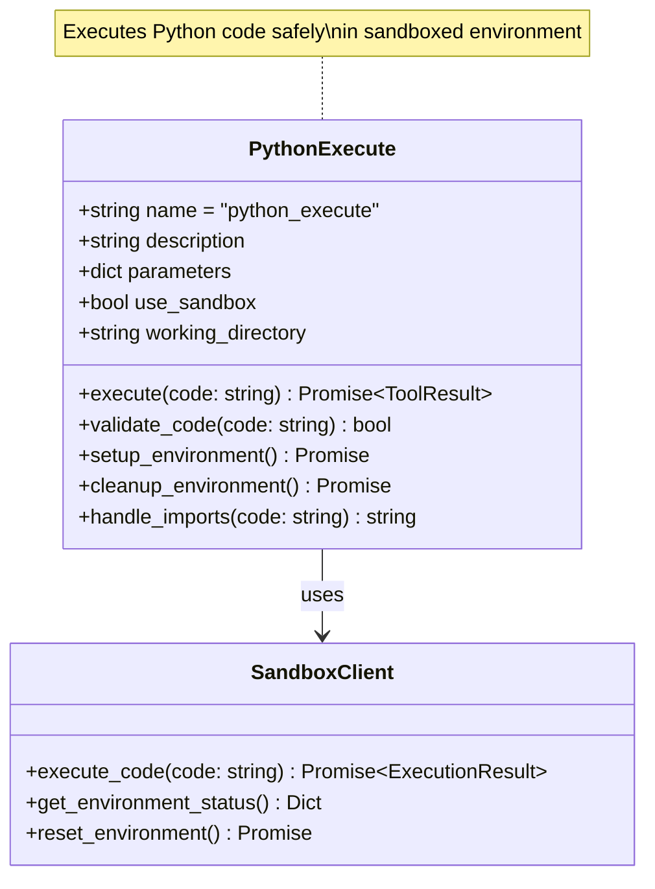
```mermaid
classDiagram
    class PythonExecute {
        +string name = "python_execute"
        +string description
        +dict parameters
        +bool use_sandbox
        +string working_directory
        
        +execute(code: string) Promise~ToolResult~
        +validate_code(code: string) bool
        +setup_environment() Promise
        +cleanup_environment() Promise
        +handle_imports(code: string) string
    }
    
    class SandboxClient {
        +execute_code(code: string) Promise~ExecutionResult~
        +get_environment_status() Dict
        +reset_environment() Promise
    }
    
    PythonExecute --> SandboxClient : uses
    
    note for PythonExecute "Executes Python code safely\nin sandboxed environment"
```

#### Python Execute Flow

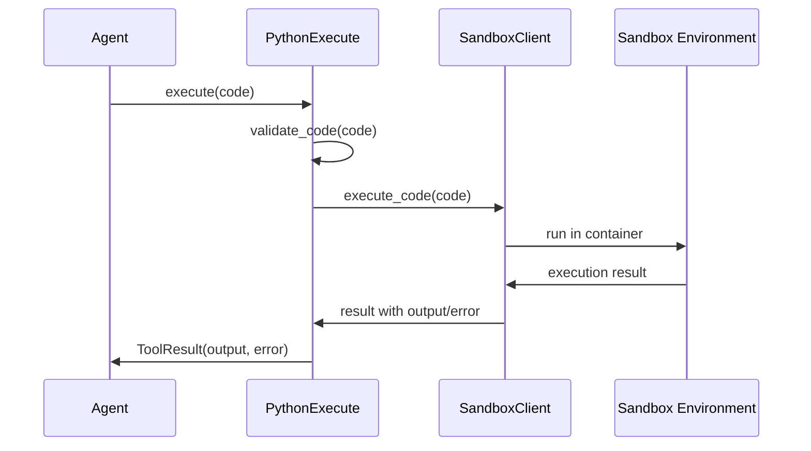
```mermaid
sequenceDiagram
    participant A as Agent
    participant PT as PythonExecute
    participant SC as SandboxClient
    participant SE as Sandbox Environment
    
    A->>PT: execute(code)
    PT->>PT: validate_code(code)
    PT->>SC: execute_code(code)
    SC->>SE: run in container
    SE->>SC: execution result
    SC->>PT: result with output/error
    PT->>A: ToolResult(output, error)
```

### String Replace Editor

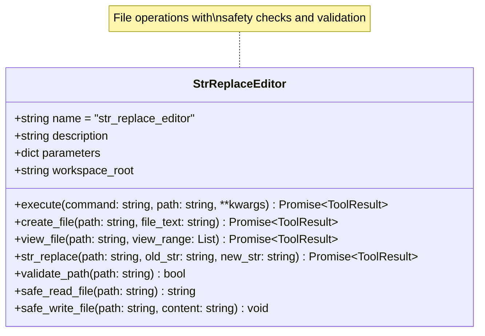
```mermaid
classDiagram
    class StrReplaceEditor {
        +string name = "str_replace_editor"
        +string description
        +dict parameters
        +string workspace_root
        
        +execute(command: string, path: string, **kwargs) Promise~ToolResult~
        +create_file(path: string, file_text: string) Promise~ToolResult~
        +view_file(path: string, view_range: List) Promise~ToolResult~
        +str_replace(path: string, old_str: string, new_str: string) Promise~ToolResult~
        +validate_path(path: string) bool
        +safe_read_file(path: string) string
        +safe_write_file(path: string, content: string) void
    }
    
    note for StrReplaceEditor "File operations with\nsafety checks and validation"
```

#### File Operation Commands

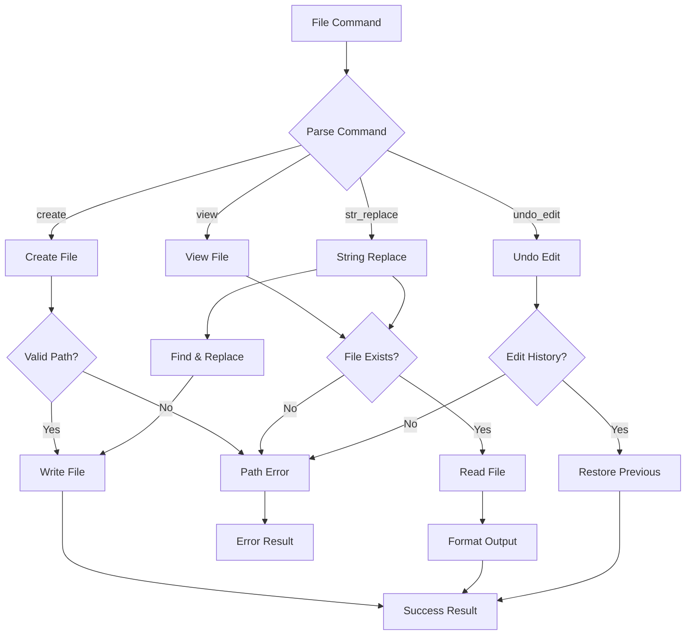
```mermaid
flowchart TD
    COMMAND[File Command] --> PARSE{Parse Command}
    
    PARSE -->|create| CREATE[Create File]
    PARSE -->|view| VIEW[View File]
    PARSE -->|str_replace| REPLACE[String Replace]
    PARSE -->|undo_edit| UNDO[Undo Edit]
    
    CREATE --> VALIDATE_PATH{Valid Path?}
    VIEW --> CHECK_EXISTS{File Exists?}
    REPLACE --> CHECK_EXISTS
    UNDO --> CHECK_HISTORY{Edit History?}
    
    VALIDATE_PATH -->|Yes| WRITE_FILE[Write File]
    VALIDATE_PATH -->|No| ERROR[Path Error]
    
    CHECK_EXISTS -->|Yes| READ_FILE[Read File]
    CHECK_EXISTS -->|No| ERROR
    
    READ_FILE --> FORMAT[Format Output]
    WRITE_FILE --> SUCCESS[Success Result]
    FORMAT --> SUCCESS
    ERROR --> FAIL[Error Result]
    
    REPLACE --> FIND_REPLACE[Find & Replace]
    FIND_REPLACE --> WRITE_FILE
    
    CHECK_HISTORY -->|Yes| RESTORE[Restore Previous]
    CHECK_HISTORY -->|No| ERROR
    RESTORE --> SUCCESS
```

### Browser Use Tool

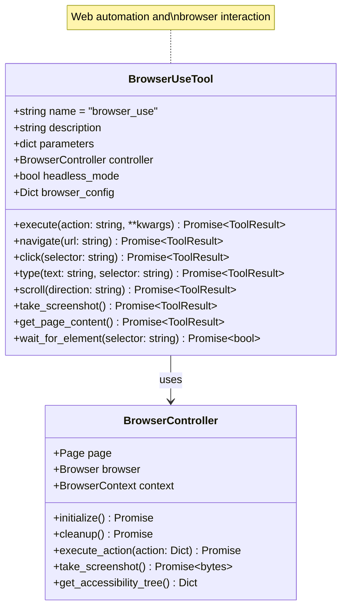
```mermaid
classDiagram
    class BrowserUseTool {
        +string name = "browser_use"
        +string description
        +dict parameters
        +BrowserController controller
        +bool headless_mode
        +Dict browser_config
        
        +execute(action: string, **kwargs) Promise~ToolResult~
        +navigate(url: string) Promise~ToolResult~
        +click(selector: string) Promise~ToolResult~
        +type(text: string, selector: string) Promise~ToolResult~
        +scroll(direction: string) Promise~ToolResult~
        +take_screenshot() Promise~ToolResult~
        +get_page_content() Promise~ToolResult~
        +wait_for_element(selector: string) Promise~bool~
    }
    
    class BrowserController {
        +Page page
        +Browser browser
        +BrowserContext context
        
        +initialize() Promise
        +cleanup() Promise
        +execute_action(action: Dict) Promise
        +take_screenshot() Promise~bytes~
        +get_accessibility_tree() Dict
    }
    
    BrowserUseTool --> BrowserController : uses
    
    note for BrowserUseTool "Web automation and\nbrowser interaction"
```

#### Browser Action Flow

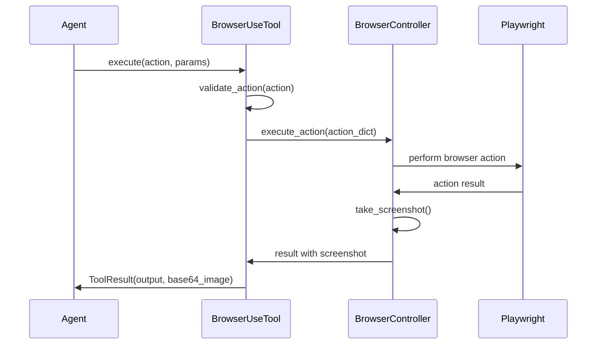
```mermaid
sequenceDiagram
    participant A as Agent
    participant BT as BrowserUseTool
    participant BC as BrowserController
    participant P as Playwright
    
    A->>BT: execute(action, params)
    BT->>BT: validate_action(action)
    BT->>BC: execute_action(action_dict)
    BC->>P: perform browser action
    P->>BC: action result
    BC->>BC: take_screenshot()
    BC->>BT: result with screenshot
    BT->>A: ToolResult(output, base64_image)
```

### Web Search Tool

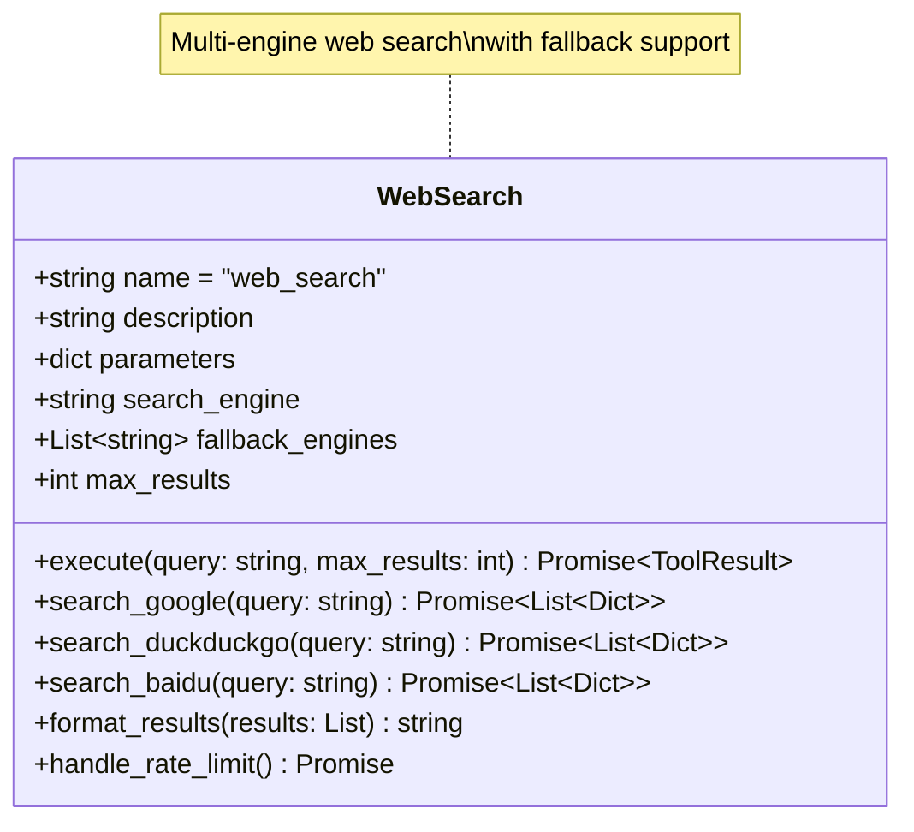
```mermaid
classDiagram
    class WebSearch {
        +string name = "web_search"
        +string description
        +dict parameters
        +string search_engine
        +List~string~ fallback_engines
        +int max_results
        
        +execute(query: string, max_results: int) Promise~ToolResult~
        +search_google(query: string) Promise~List~Dict~~
        +search_duckduckgo(query: string) Promise~List~Dict~~
        +search_baidu(query: string) Promise~List~Dict~~
        +format_results(results: List) string
        +handle_rate_limit() Promise
    }
    
    note for WebSearch "Multi-engine web search\nwith fallback support"
```

#### Search Engine Fallback

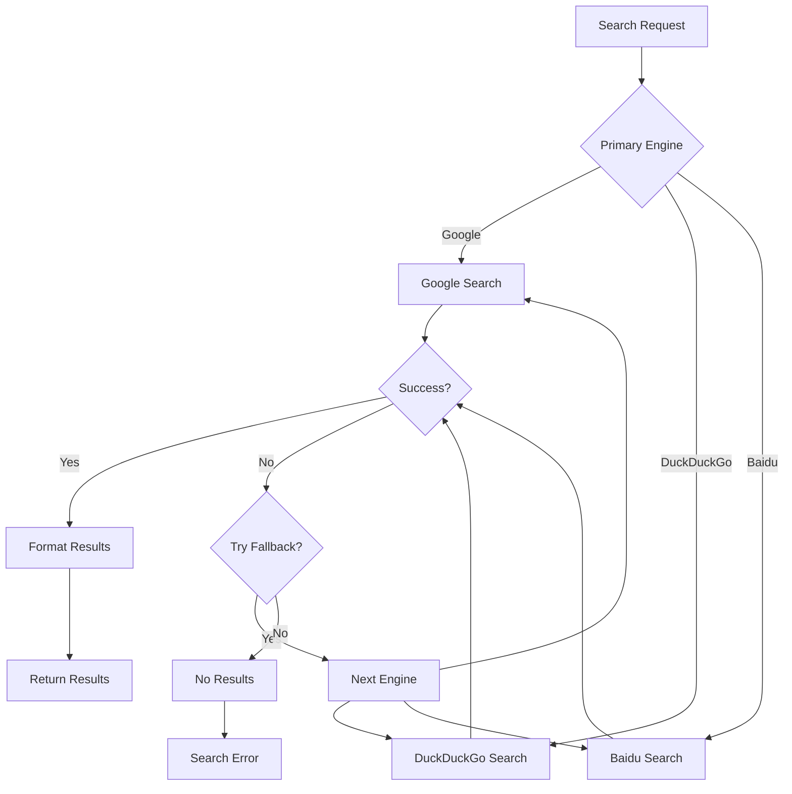
```mermaid
flowchart TD
    SEARCH_REQ[Search Request] --> PRIMARY{Primary Engine}
    
    PRIMARY -->|Google| GOOGLE[Google Search]
    PRIMARY -->|DuckDuckGo| DDG[DuckDuckGo Search]
    PRIMARY -->|Baidu| BAIDU[Baidu Search]
    
    GOOGLE --> SUCCESS{Success?}
    DDG --> SUCCESS
    BAIDU --> SUCCESS
    
    SUCCESS -->|Yes| FORMAT[Format Results]
    SUCCESS -->|No| FALLBACK{Try Fallback?}
    
    FALLBACK -->|Yes| NEXT_ENGINE[Next Engine]
    FALLBACK -->|No| NO_RESULTS[No Results]
    
    NEXT_ENGINE --> DDG
    NEXT_ENGINE --> BAIDU
    NEXT_ENGINE --> GOOGLE
    
    FORMAT --> RETURN[Return Results]
    NO_RESULTS --> ERROR[Search Error]
```

## Advanced Tools

### MCP Client Tool

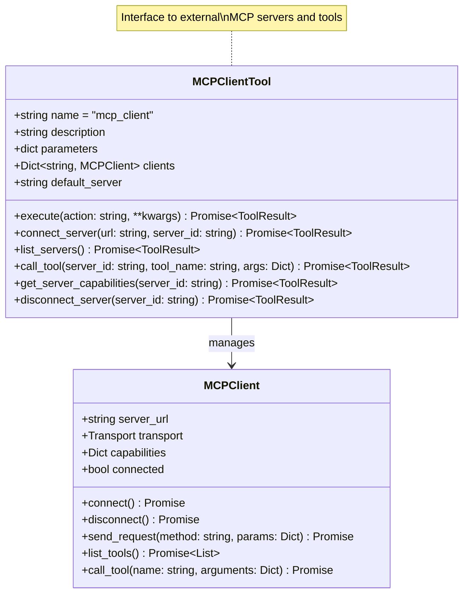
```mermaid
classDiagram
    class MCPClientTool {
        +string name = "mcp_client"
        +string description
        +dict parameters
        +Dict~string, MCPClient~ clients
        +string default_server
        
        +execute(action: string, **kwargs) Promise~ToolResult~
        +connect_server(url: string, server_id: string) Promise~ToolResult~
        +list_servers() Promise~ToolResult~
        +call_tool(server_id: string, tool_name: string, args: Dict) Promise~ToolResult~
        +get_server_capabilities(server_id: string) Promise~ToolResult~
        +disconnect_server(server_id: string) Promise~ToolResult~
    }
    
    class MCPClient {
        +string server_url
        +Transport transport
        +Dict capabilities
        +bool connected
        
        +connect() Promise
        +disconnect() Promise
        +send_request(method: string, params: Dict) Promise
        +list_tools() Promise~List~
        +call_tool(name: string, arguments: Dict) Promise
    }
    
    MCPClientTool --> MCPClient : manages
    
    note for MCPClientTool "Interface to external\nMCP servers and tools"
```

#### MCP Connection Flow

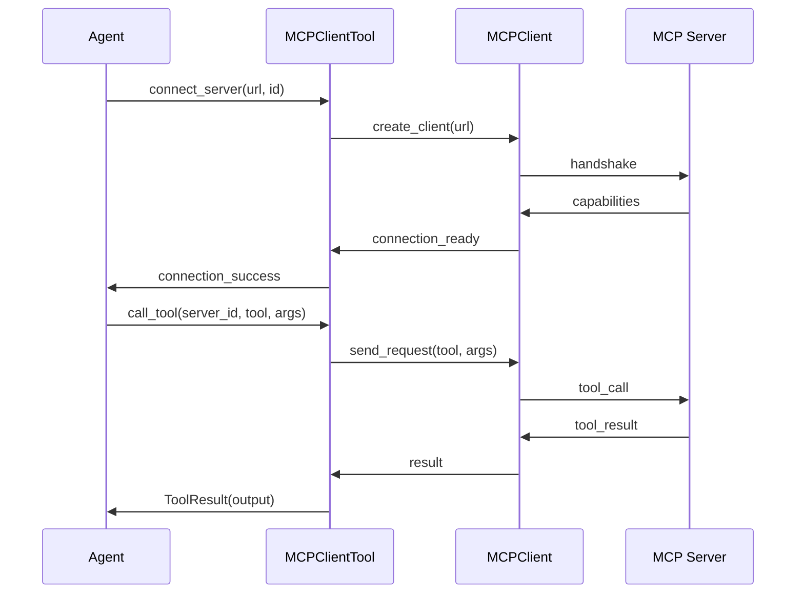
```mermaid
sequenceDiagram
    participant A as Agent
    participant MCT as MCPClientTool
    participant MC as MCPClient
    participant MS as MCP Server
    
    A->>MCT: connect_server(url, id)
    MCT->>MC: create_client(url)
    MC->>MS: handshake
    MS->>MC: capabilities
    MC->>MCT: connection_ready
    MCT->>A: connection_success
    
    A->>MCT: call_tool(server_id, tool, args)
    MCT->>MC: send_request(tool, args)
    MC->>MS: tool_call
    MS->>MC: tool_result
    MC->>MCT: result
    MCT->>A: ToolResult(output)
```

### Chart Visualization Tool

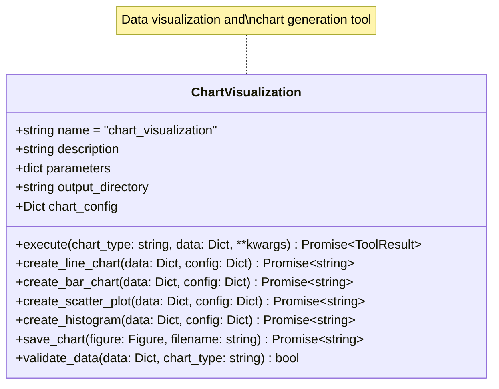
```mermaid
classDiagram
    class ChartVisualization {
        +string name = "chart_visualization"
        +string description
        +dict parameters
        +string output_directory
        +Dict chart_config
        
        +execute(chart_type: string, data: Dict, **kwargs) Promise~ToolResult~
        +create_line_chart(data: Dict, config: Dict) Promise~string~
        +create_bar_chart(data: Dict, config: Dict) Promise~string~
        +create_scatter_plot(data: Dict, config: Dict) Promise~string~
        +create_histogram(data: Dict, config: Dict) Promise~string~
        +save_chart(figure: Figure, filename: string) Promise~string~
        +validate_data(data: Dict, chart_type: string) bool
    }
    
    note for ChartVisualization "Data visualization and\nchart generation tool"
```

#### Chart Creation Flow

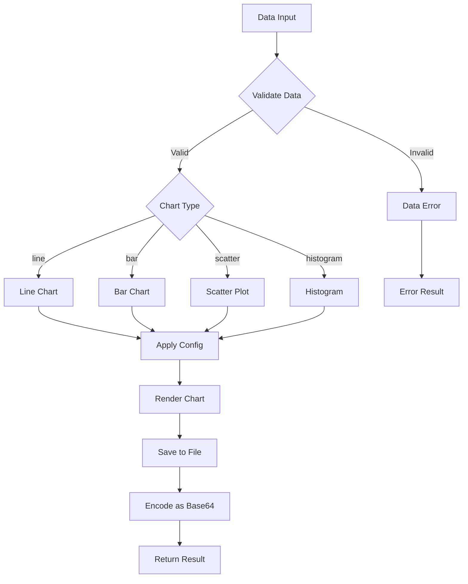
```mermaid
flowchart TD
    DATA_INPUT[Data Input] --> VALIDATE{Validate Data}
    VALIDATE -->|Invalid| ERROR[Data Error]
    VALIDATE -->|Valid| CHART_TYPE{Chart Type}
    
    CHART_TYPE -->|line| LINE[Line Chart]
    CHART_TYPE -->|bar| BAR[Bar Chart]
    CHART_TYPE -->|scatter| SCATTER[Scatter Plot]
    CHART_TYPE -->|histogram| HIST[Histogram]
    
    LINE --> CONFIG[Apply Config]
    BAR --> CONFIG
    SCATTER --> CONFIG
    HIST --> CONFIG
    
    CONFIG --> RENDER[Render Chart]
    RENDER --> SAVE[Save to File]
    SAVE --> ENCODE[Encode as Base64]
    ENCODE --> RESULT[Return Result]
    
    ERROR --> FAIL[Error Result]
```

## Tool Collection Management

### Tool Registration

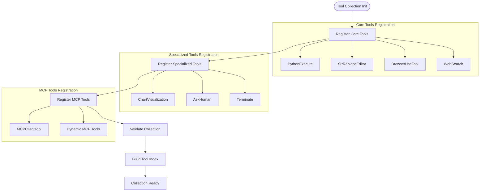
```mermaid
flowchart TD
    START([Tool Collection Init]) --> CORE[Register Core Tools]
    CORE --> SPECIAL[Register Specialized Tools]
    SPECIAL --> MCP[Register MCP Tools]
    MCP --> VALIDATE[Validate Collection]
    VALIDATE --> INDEX[Build Tool Index]
    INDEX --> READY[Collection Ready]
    
    subgraph "Core Tools Registration"
        CORE --> PYTHON_REG[PythonExecute]
        CORE --> FILE_REG[StrReplaceEditor]
        CORE --> BROWSER_REG[BrowserUseTool]
        CORE --> SEARCH_REG[WebSearch]
    end
    
    subgraph "Specialized Tools Registration"
        SPECIAL --> CHART_REG[ChartVisualization]
        SPECIAL --> ASK_REG[AskHuman]
        SPECIAL --> TERM_REG[Terminate]
    end
    
    subgraph "MCP Tools Registration"
        MCP --> MCP_CLIENT_REG[MCPClientTool]
        MCP --> DYNAMIC_REG[Dynamic MCP Tools]
    end
```

### Tool Discovery and Execution

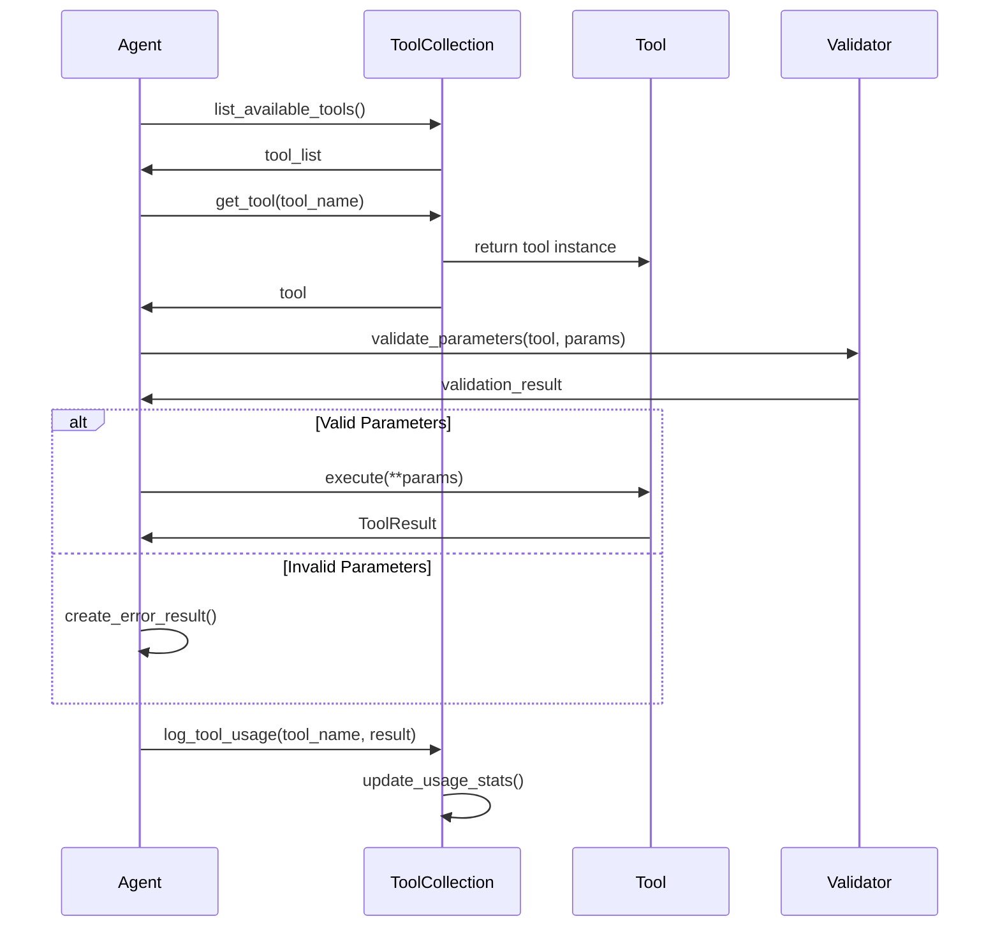
```mermaid
sequenceDiagram
    participant A as Agent
    participant TC as ToolCollection
    participant T as Tool
    participant V as Validator
    
    A->>TC: list_available_tools()
    TC->>A: tool_list
    
    A->>TC: get_tool(tool_name)
    TC->>T: return tool instance
    TC->>A: tool
    
    A->>V: validate_parameters(tool, params)
    V->>A: validation_result
    
    alt Valid Parameters
        A->>T: execute(**params)
        T->>A: ToolResult
    else Invalid Parameters
        A->>A: create_error_result()
    end
    
    A->>TC: log_tool_usage(tool_name, result)
    TC->>TC: update_usage_stats()
```

## Tool Configuration

### Tool-Specific Configuration

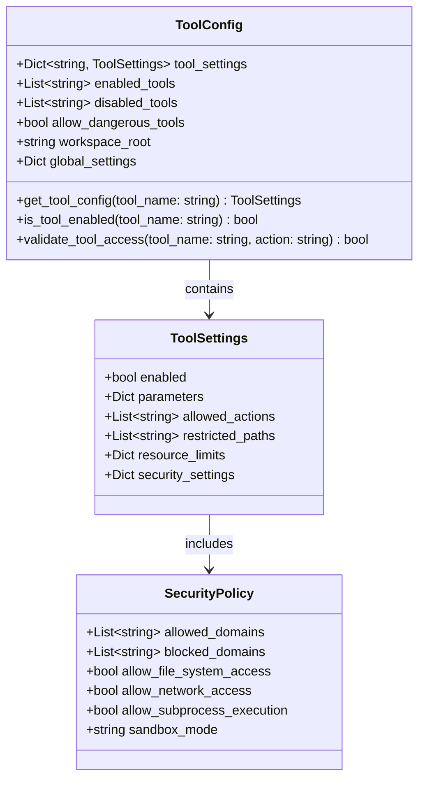
```mermaid
classDiagram
    class ToolConfig {
        +Dict~string, ToolSettings~ tool_settings
        +List~string~ enabled_tools
        +List~string~ disabled_tools
        +bool allow_dangerous_tools
        +string workspace_root
        +Dict global_settings
        
        +get_tool_config(tool_name: string) ToolSettings
        +is_tool_enabled(tool_name: string) bool
        +validate_tool_access(tool_name: string, action: string) bool
    }
    
    class ToolSettings {
        +bool enabled
        +Dict parameters
        +List~string~ allowed_actions
        +List~string~ restricted_paths
        +Dict resource_limits
        +Dict security_settings
    }
    
    class SecurityPolicy {
        +List~string~ allowed_domains
        +List~string~ blocked_domains
        +bool allow_file_system_access
        +bool allow_network_access
        +bool allow_subprocess_execution
        +string sandbox_mode
    }
    
    ToolConfig --> ToolSettings : contains
    ToolSettings --> SecurityPolicy : includes
```

## Tool Security

### Security Boundaries

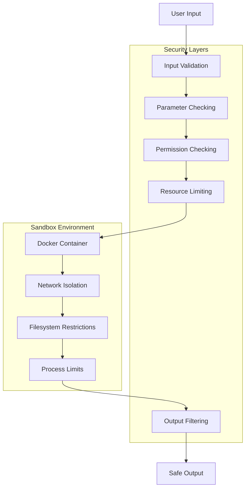
```mermaid
graph TB
    subgraph "Security Layers"
        INPUT_VAL[Input Validation]
        PARAM_CHECK[Parameter Checking]
        PERM_CHECK[Permission Checking]
        RESOURCE_LIMIT[Resource Limiting]
        OUTPUT_FILTER[Output Filtering]
    end
    
    subgraph "Sandbox Environment"
        CONTAINER[Docker Container]
        NETWORK_ISO[Network Isolation]
        FS_RESTRICT[Filesystem Restrictions]
        PROC_LIMIT[Process Limits]
    end
    
    USER_INPUT[User Input] --> INPUT_VAL
    INPUT_VAL --> PARAM_CHECK
    PARAM_CHECK --> PERM_CHECK
    PERM_CHECK --> RESOURCE_LIMIT
    
    RESOURCE_LIMIT --> CONTAINER
    CONTAINER --> NETWORK_ISO
    NETWORK_ISO --> FS_RESTRICT
    FS_RESTRICT --> PROC_LIMIT
    
    PROC_LIMIT --> OUTPUT_FILTER
    OUTPUT_FILTER --> SAFE_OUTPUT[Safe Output]
```

### Permission Model

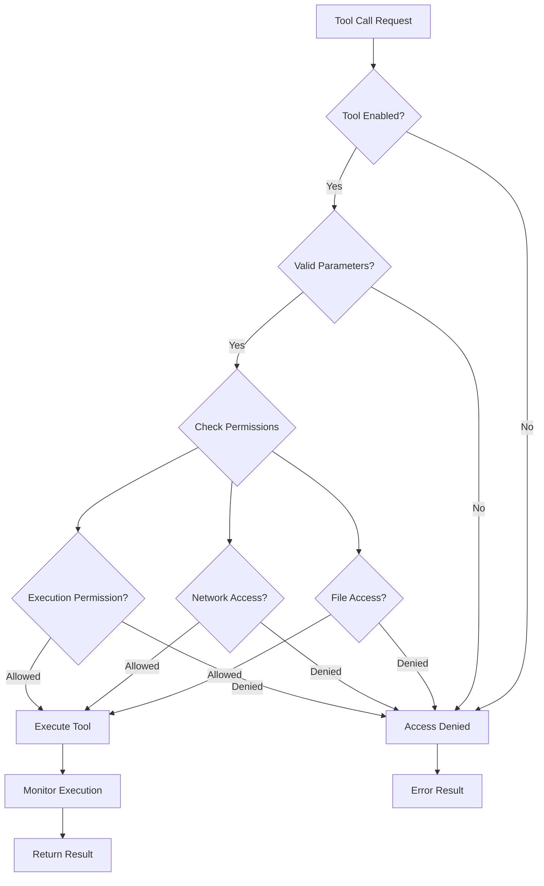
```mermaid
flowchart TD
    TOOL_CALL[Tool Call Request] --> CHECK_ENABLED{Tool Enabled?}
    CHECK_ENABLED -->|No| DENY[Access Denied]
    CHECK_ENABLED -->|Yes| CHECK_PARAMS{Valid Parameters?}
    
    CHECK_PARAMS -->|No| DENY
    CHECK_PARAMS -->|Yes| CHECK_PERMS{Check Permissions}
    
    CHECK_PERMS --> FILE_PERM{File Access?}
    CHECK_PERMS --> NET_PERM{Network Access?}
    CHECK_PERMS --> EXEC_PERM{Execution Permission?}
    
    FILE_PERM -->|Allowed| EXECUTE[Execute Tool]
    NET_PERM -->|Allowed| EXECUTE
    EXEC_PERM -->|Allowed| EXECUTE
    
    FILE_PERM -->|Denied| DENY
    NET_PERM -->|Denied| DENY
    EXEC_PERM -->|Denied| DENY
    
    EXECUTE --> MONITOR[Monitor Execution]
    MONITOR --> RESULT[Return Result]
    DENY --> ERROR[Error Result]
```

## Custom Tool Development

### Creating a Custom Tool

```python
from app.tool.base import BaseTool, ToolResult
from typing import Any, Dict, Optional
import asyncio

class CustomTool(BaseTool):
    """Example custom tool implementation."""
    
    name = "custom_tool"
    description = "A custom tool that performs specific operations"
    parameters = {
        "type": "object",
        "properties": {
            "operation": {
                "type": "string", 
                "description": "The operation to perform",
                "enum": ["create", "read", "update", "delete"]
            },
            "target": {
                "type": "string",
                "description": "The target for the operation"
            },
            "options": {
                "type": "object",
                "description": "Optional configuration",
                "properties": {
                    "timeout": {"type": "number", "default": 30},
                    "retry": {"type": "boolean", "default": False}
                }
            }
        },
        "required": ["operation", "target"]
    }
    
    async def execute(
        self, 
        operation: str, 
        target: str, 
        options: Optional[Dict[str, Any]] = None
    ) -> ToolResult:
        """Execute the custom tool operation."""
        try:
            # Validate inputs
            if not self._validate_operation(operation):
                return ToolResult(error=f"Invalid operation: {operation}")
            
            # Set defaults
            options = options or {}
            timeout = options.get("timeout", 30)
            retry = options.get("retry", False)
            
            # Perform operation with timeout
            result = await asyncio.wait_for(
                self._perform_operation(operation, target, options),
                timeout=timeout
            )
            
            return ToolResult(output=result)
            
        except asyncio.TimeoutError:
            return ToolResult(error=f"Operation timed out after {timeout}s")
        except Exception as e:
            if retry:
                # Implement retry logic
                return await self._retry_operation(operation, target, options)
            return ToolResult(error=f"Operation failed: {str(e)}")
    
    def _validate_operation(self, operation: str) -> bool:
        """Validate that the operation is allowed."""
        allowed_ops = ["create", "read", "update", "delete"]
        return operation in allowed_ops
    
    async def _perform_operation(
        self, 
        operation: str, 
        target: str, 
        options: Dict[str, Any]
    ) -> str:
        """Implement the actual operation logic."""
        # Implementation depends on the specific tool
        if operation == "create":
            return f"Created {target}"
        elif operation == "read":
            return f"Read {target}"
        elif operation == "update":
            return f"Updated {target}"
        elif operation == "delete":
            return f"Deleted {target}"
        else:
            raise ValueError(f"Unknown operation: {operation}")
    
    async def _retry_operation(
        self, 
        operation: str, 
        target: str, 
        options: Dict[str, Any]
    ) -> ToolResult:
        """Implement retry logic for failed operations."""
        try:
            await asyncio.sleep(1)  # Brief delay before retry
            result = await self._perform_operation(operation, target, options)
            return ToolResult(output=f"Retry successful: {result}")
        except Exception as e:
            return ToolResult(error=f"Retry failed: {str(e)}")
```

### Tool Integration Pattern

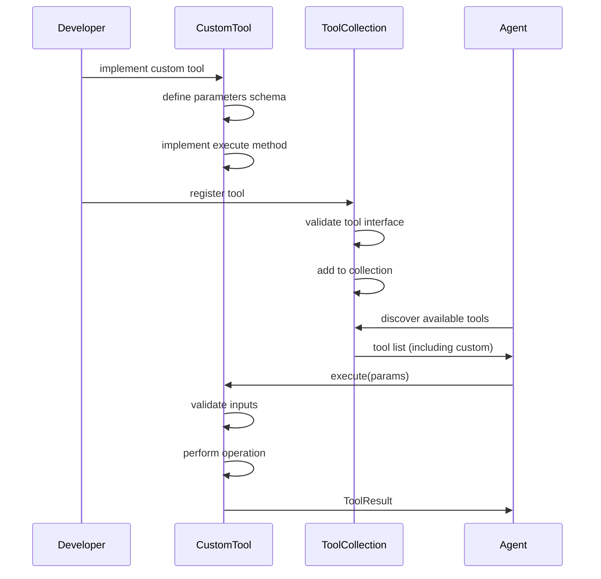
```mermaid
sequenceDiagram
    participant D as Developer
    participant T as CustomTool
    participant TC as ToolCollection
    participant A as Agent
    
    D->>T: implement custom tool
    T->>T: define parameters schema
    T->>T: implement execute method
    
    D->>TC: register tool
    TC->>TC: validate tool interface
    TC->>TC: add to collection
    
    A->>TC: discover available tools
    TC->>A: tool list (including custom)
    
    A->>T: execute(params)
    T->>T: validate inputs
    T->>T: perform operation
    T->>A: ToolResult
```

## Tool Performance Optimization

### Caching Strategy

```mermaid
graph TB
    subgraph "Cache Layers"
        MEM_CACHE[Memory Cache]
        DISK_CACHE[Disk Cache]
        REDIS_CACHE[Redis Cache]
    end
    
    subgraph "Cache Policies"
        LRU[LRU Eviction]
        TTL[Time-based Expiry]
        SIZE_LIMIT[Size Limits]
    end
    
    TOOL_CALL[Tool Call] --> CHECK_CACHE{Check Cache}
    CHECK_CACHE -->|Hit| MEM_CACHE
    CHECK_CACHE -->|Miss| EXECUTE[Execute Tool]
    
    MEM_CACHE --> RESULT[Return Cached Result]
    EXECUTE --> STORE_CACHE[Store in Cache]
    STORE_CACHE --> RESULT
    
    LRU --> MEM_CACHE
    TTL --> DISK_CACHE
    SIZE_LIMIT --> REDIS_CACHE
```

### Performance Monitoring

```mermaid
graph TB
    subgraph "Metrics Collection"
        EXEC_TIME[Execution Time]
        SUCCESS_RATE[Success Rate]
        ERROR_RATE[Error Rate]
        RESOURCE_USAGE[Resource Usage]
    end
    
    subgraph "Performance Analysis"
        TRENDS[Trend Analysis]
        BOTTLENECKS[Bottleneck Detection]
        OPTIMIZATION[Optimization Suggestions]
    end
    
    TOOL_EXECUTION[Tool Execution] --> EXEC_TIME
    TOOL_EXECUTION --> SUCCESS_RATE
    TOOL_EXECUTION --> ERROR_RATE
    TOOL_EXECUTION --> RESOURCE_USAGE
    
    EXEC_TIME --> TRENDS
    SUCCESS_RATE --> TRENDS
    ERROR_RATE --> BOTTLENECKS
    RESOURCE_USAGE --> OPTIMIZATION
```

This tool system documentation provides comprehensive coverage of the OpenManus tool architecture, from basic concepts to advanced customization patterns. The modular design allows for easy extension while maintaining security and performance standards.